# Lab Guide - LTROBS-2005 - Splunk AppDynamics: Hands-on with Observability for hybrid applications - SmartAgent, Kubernetes, OpenTelemetry and more

<!-- 
============================================================================
                           TABLE OF CONTENTS
============================================================================
-->

## Table of Contents

1. [Introduction](#introduction)
   - [Learning Objectives](#learning-objectives)
   - [Lab Overview](#lab-overview)
   - [Total Lab Time](#total-lab-time)
2. [Lab Environment](#lab-environment)
   - [Topology and Nodes](#topology-and-nodes)
   - [Prerequisites](#prerequisites)
   - [Software Requirements](#software-requirements)
3. [Getting Started](#getting-started)
   - [Connecting to the Lab](#connecting-to-the-lab)
   - [Setting Up the Lab Environment](#setting-up-the-lab-environment)
4. [Starting the Application](#starting-the-application)
   - [Starting the Database](#starting-the-db)
   - [Starting Services in Kubernetes](#starting-services-in-kubernetes)
   - [Starting the Visits Service](#starting-visits-service-on-the-java-node)
5. [Installing AppDynamics Agents](#installing-appdynamics-agents-with-ansible)
   - [Cluster Agent Installation](#install-the-cluster-agent-on-microk8s)
   - [Smart Agent Installation](#use-smartagentcli-for-agent-installation)
   - [Java Agent Installation](#installing-java-agent-using-appd-gui)
   - [Database Agent Installation](#installing-db-using-appd-gui)
   - [Bulk Upgrading Machine Agents](#bulk-upgrading-machine-agents)
6. [Configuring Monitoring](#configuring-monitoring)
   - [Browser Real User Monitoring](#installing-browser-real-user-monitoring-brum)
   - [Log Observer Connect](#log-observer-connect)
   - [Health Rules](#health-rule-creation)
   - [Business Transactions](#business-transaction-detection--refinement)
7. [Advanced Configuration](#advanced-configuration)
   - [OpenTelemetry Integration](#adding-opentelemetry)
   - [Backend Detection Rules](#backend-detection-rules)
8. [Lab Guide Summary](#lab-guide-summary)
   - [What You've Accomplished](#what-youve-accomplished)
   - [Key Takeaways](#key-takeaways)
   - [Real-World Application](#real-world-application)
   - [Next Steps](#next-steps)
   - [Resources for Further Learning](#resources-for-further-learning)

<!-- 
============================================================================
                           INTRODUCTION
============================================================================
-->

## Introduction
*Estimated Time: 10-15 minutes* | *Reading & Understanding*

### Learning Objectives

This hands-on lab is designed to equip participants with the practical skills necessary to leverage Splunk AppDynamics for achieving observability in complex hybrid application environments. Upon completion of this lab, participants will be able to:

* **Set up a hybrid environment**: Build a representative hybrid application environment utilizing Ansible for automation, MicroK8s for container orchestration, and the spring-petclinic-microservices application as a distributed system.

* **Implement AppDynamics integration**: Gain practical experience integrating this environment with Splunk AppDynamics using SmartAgent and Ansible for simplified agent management, Kubernetes monitoring for containerized workloads, and OpenTelemetry for standardized telemetry data collection.

* **Utilize observability tools**: Effectively use Splunk AppDynamics and Log Observer Connect to monitor application performance, trace business transactions across hybrid infrastructure, and conduct insightful log analysis tailored to specific observability needs.

### Lab Overview

In this lab, you will work with a distributed microservices application deployed across multiple nodes in a hybrid environment (both containerized and non-containerized). You'll implement and configure various AppDynamics components to achieve comprehensive observability across this environment.

> **What you'll learn**: Setting up, configuring, and using AppDynamics components in a hybrid microservices architecture to achieve end-to-end observability.

### Total Lab Time
*Estimated completion time: 3-4 hours*

This lab is divided into sections with individual time estimates to help you plan your session:

| Section | Time Estimate | Description |
|---------|---------------|-------------|
| Environment Setup | 30 minutes | Setting up VPN connection and lab infrastructure |
| Application Deployment | 30 minutes | Deploying the microservices application |
| Agent Installation | 45 minutes | Installing and configuring AppDynamics agents |
| Configuration and Monitoring | 60-90 minutes | Setting up monitoring and observability tools |
| Advanced Topics | 45 minutes | Advanced configuration for comprehensive monitoring |

---

---

<!-- 
============================================================================
                           LAB ENVIRONMENT
============================================================================
-->

## Lab Environment
*Estimated Time: 5 minutes* | *Reading & Understanding*

### Topology and Nodes

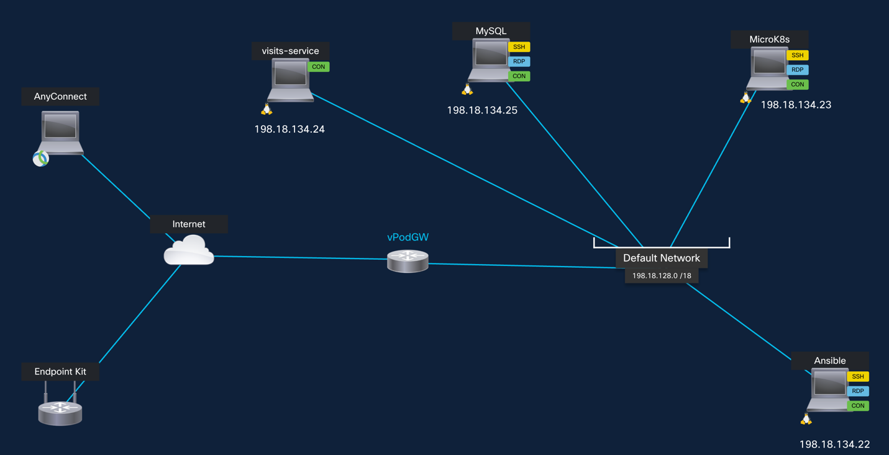
*Image 1: Topology Diagram*

The lab environment consists of the following nodes:

| Node | IP Address | Role | Software Components |
|------|------------|------|---------------------|
| **Ansible-x** | 198.18.134.22 | Automation Server | Ansible, AppdCLI, AppD Smartagent |
 **microk8s-x** | 198.18.134.23 | Kubernetes Server | MicroK8s |
 **visits-service-x** | 198.18.134.24 | Java Application | Java, Maven/Gradle, Spring Boot App |
 **petclinic-db-x** | 198.18.134.25 | Database Server | MySQL |

### Prerequisites

#### Required Knowledge

Before beginning this lab, participants should have:

* **Linux Basics**: 
  - Familiarity with common shell commands (`cd`, `ls`, etc.)
  - Basic file editing using a terminal editor (Vi/Vim)
  - Understanding of file permissions and user management

* **Container/Kubernetes Concepts**:
  - Understanding of containerization principles
  - Basic knowledge of Kubernetes resources (pods, services, deployments)
  - Familiarity with `kubectl` commands

* **Monitoring Fundamentals**:
  - Understanding of application performance monitoring
  - Knowledge of metrics, logs, and traces
  - Familiarity with monitoring dashboards

* **Microservices Knowledge**:
  - Understanding of distributed application architecture
  - Familiarity with service-to-service communication
  - Basic understanding of API concepts

#### Software Requirements

The following software must be installed on your local machine:

 Software | Version | Purpose | Installation Link |
----------|---------|---------|------------------|
 **Cisco Secure Client** | Latest | VPN connection to lab | [Download](https://www.cisco.com/c/en/us/support/security/anyconnect) |

### Setting Up the Lab Environment

This section details the steps required to prepare the virtual machines for this lab. Execute these commands on **each** lab node:

1. **Clone the Repository:**
   ```bash
   git clone git@github.com:noMoreCLI/spring-petclinic-microservices.git
   ```

2. **Navigate to Setup Directories and Execute Scripts:**

   * **Ansible Setup:**
     ```bash
     cd spring-petclinic-microservices/deployment/hybrid/setup/ansible
     sudo ./setup.sh
     ```
   
   * **MicroK8s Setup:**
     ```bash
     cd spring-petclinic-microservices/deployment/hybrid/setup/microk8s
     sudo ./setup.sh
     ```
   
   * **MySQL Setup:**
     ```bash
     cd spring-petclinic-microservices/deployment/hybrid/setup/mysql
     sudo ./setup.sh
     ```
   
   * **Visits Service Setup:**
     ```bash
     cd spring-petclinic-microservices/deployment/hybrid/setup/visits-service
     sudo ./setup.sh
     ```
   
   **Note:** You will be prompted for your sudo password when executing these scripts.

3. **Reboot the Nodes:**
   ```bash
   sudo reboot
   ```

4. **Reconnect via SSH:**
   After the nodes restart, re-establish your SSH connection to each one before proceeding with the lab exercises.

Once these steps are completed on all lab machines, the environment will be ready for Splunk AppDynamics integration.

---

## Starting the Application

It is important to start up the application components in the right order. There are only limited failure checks available.

### Starting the DB

1. Connect to the database VM (198.18.134.25) using SSH:
   ```bash
   ssh cisco@198.18.134.25
   ```

2. Navigate to the hybrid application deployment directory:
   ```bash
   cd ~/spring-petclinic-microservices/deployments/hybrid/petclinic-db
   ```

3. The database is running as a stateless container on that host. You can start the DB with all initializations running:
   ```bash
   docker-compose up -d
   ```


> [!TIP]
> To see the logs, you can issue the command:
>   ```bash
>   docker-compose logs
>   ```
>   
>   The MySQL port is exposed to the host using port 3306. If you want to see the DB initialization, you can find the SQL scripts applied on  container start here: `~/spring-petclinic-microservices/deployments/config/db`.
>   
>   The database comes with schema, sample data, users and everything else needed for the lab.>
>
> For debugging purposes, you can connect to the MySQL DB from the DB  
> server using:
>   ```bash
>   mysql -u root -P 3306 --protocol=tcp -h localhost -p petclinic
>   ```


### Starting Services in Kubernetes

1. Connect to the microk8s VM (198.18.134.23) using SSH:
   ```bash
   ssh cisco@198.18.134.23
   ```

2. Navigate to the hybrid application deployment directory:
   ```bash
   cd ~/spring-petclinic-microservices/deployments/hybrid/microk8s
   ```

3. Deploy the services into the Kubernetes cluster:
   ```bash
   ./deploy.sh
   ```
   
   This will create two namespaces:
   * `petclinic`: the main application
   * `notification`: an external operated notification service

4. Verify the correct operation of the application using the following commands:
   ```bash
   kubectl get pods -A
   ```
   
   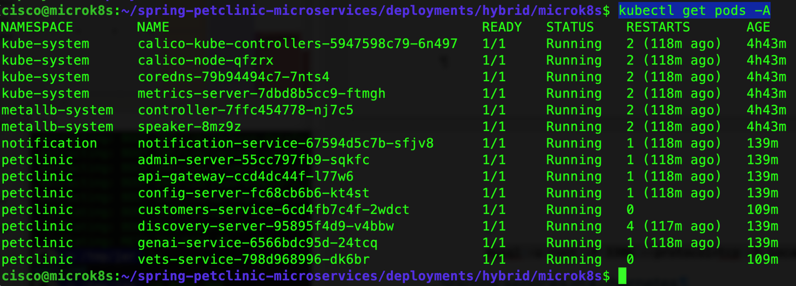
   *Image 2: `kubectl get pods -A` output*

   All pods should be in a running state. If they are not, either delete the pod or ask for help.

   ```bash
   kubectl get svc -n petclinic
   ```
   
   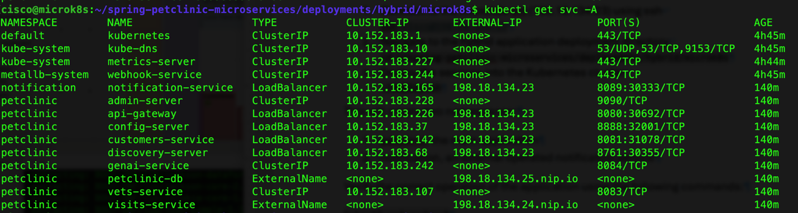
   *Image 3: kubectl get svc -n petclinic output*

   You should see that multiple services running in the K8s cluster are exposed on the node IP and hence accessible from the other machines. All are running on `198.18.134.23`.

   | Service Name     | Port |
   |------------------|------|
   | Api-gateway      | 8080 |
   | config-server    | 8888 |
   | discovery-server | 8761 |
   | customer-service | 8081 |

### Starting Visits Service on the Java Node

The last service to be started is the legacy visits service running on its dedicated VM.

1. Connect to the java VM (198.18.134.24) using SSH:
   ```bash
   ssh cisco@198.18.134.24
   ```

2. Navigate to the hybrid application deployment directory:
   ```bash
   cd ~/spring-petclinic-microservices/deployments/hybrid/java
   ```

3. Run the service in the foreground:
   ```bash
   ./run.sh
   ```

### Navigate to the UI

All application services are up and running after 1-2 minutes. You should be able to navigate to the main application: 

```
http://198.18.134.23:8080/#!/welcome
```

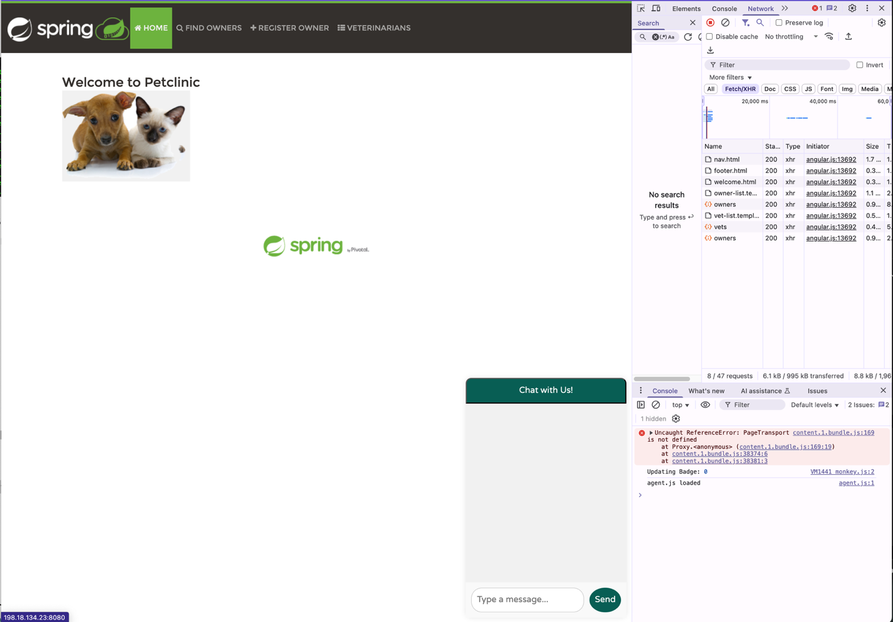
*Image 4: Petclinic Welcome Page with Developer Tools open*

Please note, the GenAI service (chatbot) is not operational in this lab. You can safely ignore it and all errors associated with it.

Feel free to browse the Application and familiarize yourself with it before proceeding.

---

## Connecting to the Ansible Node

To execute Ansible playbooks and manage the lab environment, you'll need to establish an SSH connection to the designated Ansible node. Here's a general procedure:

1. **Open a Terminal:** 
   Launch a terminal application on your local machine.

2. **Identify Ansible Node IP:** 
   Determine the IP address or hostname of the Ansible node within your dCloud environment. This information is typically provided in the dCloud session details or lab instructions.

3. **Use the SSH Command:** 
   Use the ssh command:
   ```bash
   ssh cisco@198.18.134.22
   ```

---

## Installing AppDynamics Agents with Ansible

This section describes how to install the AppDynamics Cluster Agent, Smart Agent, and Machine Agent using a created Ansible playbook and SmartAgentCLI.

### Install the Cluster Agent on Microk8s

1. Navigate to the `~/spring-petclinic-microservices/cluster-agent/` directory:
   ```bash
   cd ~/spring-petclinic-microservices/cluster-agent/
   ```

2. Edit the variables for your environment

### Understanding the Cluster Agent Configuration on Microk8s

In order to install and configure the cluster agent we needed to define our helm chart values file. Below you will find that file explained for the different options that we have enabled for the lab. Spend some time to understand the different settings that were required. Feel free to ask us any question you may have. The file being explained is `cluster-agent/cluster-agent-values.yaml.j2`. Jinja files are templates used by the Jinja templating engine, primarily in Python applications. Think of them as blueprints for text-based formats like HTML, XML, or in our case .yaml configuration files.

**Top-Level Settings:**

* `installClusterAgent: true`: This setting indicates that the AppDynamics Cluster Agent should be installed. The Cluster Agent is responsible for collecting metrics and events from your Kubernetes cluster.
* `installInfraViz: true`: This setting indicates that the Infrastructure Visibility (InfraViz) component should be installed. InfraViz provides insights into the health and performance of your underlying infrastructure nodes.

**`infraViz` Section:**
This section configures the Infrastructure Visibility component:

* `nodeOS: "linux"`: Specifies that the operating system of the nodes in your cluster is Linux.
* `enableMasters: true`: Indicates that metrics and visibility should be collected from the Kubernetes master nodes.
* `stdoutLogging: false`: Disables logging of InfraViz output to the standard output. Logs will be directed to a different logging mechanism.
* `enableContainerHostId: true`: Enables the collection and reporting of the container host ID, which helps in uniquely identifying the underlying host for containers.
* `enableServerViz: true`: Enables the collection and reporting of server-level metrics (CPU, memory, disk, network) from the nodes.
* `enableDockerViz: false`: Disables the collection of Docker-specific metrics.

**`netViz` Section:**
This section configures the Network Visibility component:

* `enabled: true`: Indicates that Network Visibility should be enabled. Network Visibility helps in understanding the communication pathways and performance between services in your cluster.
* `netVizPort: 3892`: Specifies the port that the Network Visibility component will use for communication.

**`controllerInfo` Section:**
This section provides the necessary information to connect to your AppDynamics Controller:

* `url: "{{ controller_url }}"`: The URL of your AppDynamics Controller. The `{{ ... }}` this is a placeholder that will be replaced with the actual Controller URL during deployment.
* `account: "{{ controller_account }}"`: Your AppDynamics Global Account Name. Similar to the URL, this is a placeholder.
* `accessKey: "{{ controller_access_key }}"`: Your AppDynamics Access Key. This is also a placeholder for the actual access key.

**`clusterAgent` Section:**
This section configures the AppDynamics Cluster Agent itself:

* `appName: "{{ app_name }}"`: The default application name that will be used for entities discovered by the Cluster Agent. This is a placeholder.
* `nsToMonitorRegex: "{{ namespace_to_instrument }}"`: A regular expression that defines which Kubernetes namespaces the Cluster Agent should monitor for overall cluster health and events. This is a placeholder and intended to match the namespaces where applications are instrumented.
* `logProperties:`: Configuration for the Cluster Agent's logging:
    * `logLevel: INFO`: Sets the logging level to "INFO", meaning informational messages and higher severity messages will be logged.
    * `stdoutLogging: true`: Enables logging of the Cluster Agent's output to the standard output.

**`instrumentationConfig` Section:**
This section configures the automatic instrumentation of applications running in your cluster:

* `enabled: true`: Indicates that automatic instrumentation is enabled.
* `enableForceReInstrumentation: true`: If set to true, the system will attempt to re-instrument pods even if they have been instrumented before. This can be useful in certain update scenarios.
* `instrumentationMethod: Env`: Specifies that instrumentation will be done by injecting environment variables into the application containers. This is a common method for automatic instrumentation.
* `nsToInstrumentRegex: "{{ namespace_to_instrument }}"`: A regular expression that defines which Kubernetes namespaces should be targeted for automatic instrumentation. This is a placeholder.
* `defaultAppName: "{{ app_name }}"`: The default application name to be used for automatically instrumented applications if a more specific name isn't determined. This is a placeholder.
* `tierNameStrategy: manual`: Indicates that the tier names for the instrumented applications will be derived from pod labels or annotations, rather than being automatically generated.
* `imageInfo:`: Specifies information about the agent images to be used for instrumentation:
    * `java:`: Configuration specific to Java applications:
        * `image: "docker.io/appdynamics/java-agent:latest"`: The Docker image to be used for the Java agent. It's pulling the latest version from Docker Hub.
        * `agentMountPath: /opt/appdynamics`: The path within the application container where the Java agent will be mounted.
        * `imagePullPolicy: Always`: Specifies that the image should always be pulled from the registry, even if a local version exists.
* `instrumentationRules:`: Defines specific rules for how applications should be instrumented:
    * `- namespaceRegex: "{{ namespace_to_instrument }}"`: This rule applies to namespaces matching the provided regular expression (placeholder).
        * `language: java`: Specifies that this rule applies to Java applications.
        * `matchString: ".*"`: This is a broad regular expression that will match all containers within the specified namespaces.
        * `imageInfo:`: Overrides the default `imageInfo` for this specific rule, using the same Java agent image, mount path, and pull policy as defined above.

### Use SmartAgentCLI for Agent Installation

AppDynamics provides pre-written Ansible playbooks in the form a linux binary for simplified agent deployment. These playbooks are provided with SmartAgentCLI tool.

SmartAgentCLI in this lab will install:

* Smart Agent on all three nodes.
    * **NOTE:** We don't need SmartAgent on the MicroK8s node but we are installing it to show bulk installations on 3 nodes as part of this lab.
* Machine Agent on 2 nodes `visits-service-x` and `petclinic-db-x`.

#### Running Local Web-Server

1.  Navigate to the `appdsm/` directory to configure the web server for agent distribution.
2.  The `web-server.sh` script utilizes Python's built-in HTTP server to host agent files locally.
    ```bash
    ./web-server.sh
    ```
    This provides a convenient way to distribute agent binaries within your network. The webserver will run in the background. You can test it with:
    ```bash
    curl 0:8000
    ```
    <span style="color: red">**NOTE:** THIS SCRIPT IS NOT PROVIDED BY APPD.
    It was written for the lab to demonstrate accessing a webserver with the AppdCLI tool. We are making use of the built-in python `http.server` module and is a good tip and trick to keep in your back pocket should you ever need to host files within an internal environment. It is over port 80 so inherently insecure.</span>

### Agent Installation Process

Lab users should examine the commands within the `bulk-install-*.sh` scripts as well the files in the directory to understand the power of the SmartAgentCLI syntax and the underlying agent installation process. This will provide valuable insight into how SmartAgentCLI can simplify and automate AppDynamics agent deployment.

The inventory file is a good example for how to build file for multiple hosts.

**Preparation:**

1.  Navigate to `appdcli/` directory.
2.  Run the `./install-script.sh` with sudo.
3.  Verify file permissions if error. You make need to `chmod +x install-script.sh`

**Bulk Installation Scripts and Understanding the SmartAgentCLI tool:**

Execute the following scripts. You may need to make the files executable with `chmod +x install-script.sh`

* **`bulk-install-sm.sh`**: Smart Agent installation
    ```bash
    sudo ./appd install smartagent -i inventory --auto-start -q ssh -u http://0.0.0.0:8000/appdsmartagent_64_linux_25.4.0.1247.zip -vvvv
    ```
    This command is used to install the AppDynamics Smart Agent with the following specifications:
    * `smartagent`: indicates that we are installing the smartagent or the machine agent.
    * `-i inventory`: Specifies the Ansible inventory file to use. Be sure to take a look at the inventory file to understand how we have that configured as well the different variable options that we put in place.
    * `--auto-start` or `-k`: Configures the Smart Agent to start automatically.
    * `-q ssh`: Sets the Ansible connection option to use SSH.
    * `-u <URL>`: Specifies the download URL for the Smart Agent package.
    * `-vvvv`: Enables maximum verbosity level for Ansible (equivalent to `--verboseVVVV`).

* **`bulk-install-ma.sh`**: Machine Agent installation
    ```bash
    sudo ./appd install machine -i inventory --auto-start -q ssh -m machineagent
    ```
    The only difference for this step is that we are using a different group within the Ansible inventory file. Take a look at the inventory file to understand how we created the groups, as well as any inventory variables that we needed to configure to make SmartAgentCLI successful in running the playbooks.
    * `-m machineagent`: This is referring to a group within the ansible inventory file. Be sure to take a look at the inventory file to understand how we have that configured as well the different variable options that we put in place.

### Post-Installation Verification

**Health Check Commands:**

* **For Cluster Agent:**
Run this from the microk8s host as the ansible host does not have `kubectl` installed.
    ```bash
    ssh cisco@198.18.134.23
    kubectl get pods -n appdynamics
    kubectl logs -n appdynamics deployment/appdynamics-cluster-agent
    ```
* **For Machine Agent:**
    ```bash
    ssh cisco@198.18.134.24
    systemctl status appdynamics-machine-agent
    ```
* **For SmartAgent:**
    ```bash
    ssh cisco@198.18.134.24
    systemctl status smartagent
    ```

**Check Controller UI:**

* Verify agents appear in the Controller under Agent Management.
* Check for metrics collection from the Machine agent.
* Validate application has some items in flow map topology. It will not be the full map because we have yet to instrument the `visits-service-x` node. 

---
## Bulk Upgrading Machine Agents 

### Objective
In this section of the lab we are going to be upgrade our machine agent on the hosts `visits-service-x` and `petclinic-db-x`. In order to do this we are going to make use of the Upgrade feature built-in to the Appdynamics GUI. This makes upgrades incredibily easy to make, with just a few clicks can kick off AppD agent upgrades. 

### Prerequisites
* Access to AppDynamics Controller
* Successfully ran the `./bulk-install-ma.sh` script from the previous section
* SmartAgent already installed on the target host (`visits-service-x` and `petclinic-db-x`)

### Step 1: Navigate to Agent Management

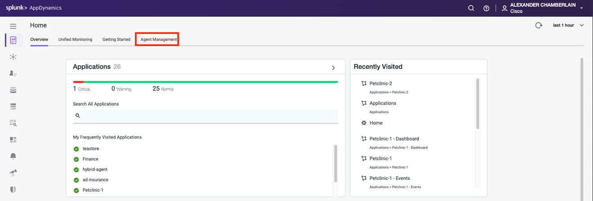
*Image 5: AppDynamics Home Screen with Agent Management tab highlighted.*

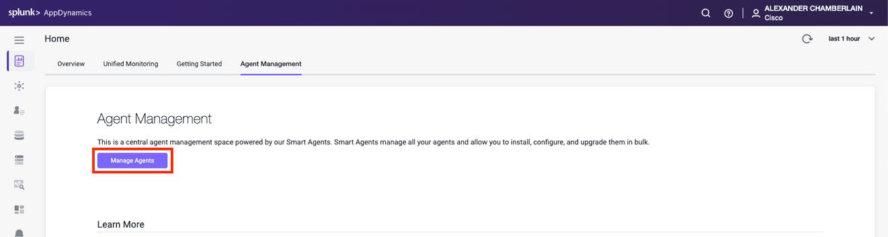
*Image 6: Agent Management screen with Manage Agents button highlighted.*

From the AppDynamics Overview Page, locate and click on the **Agent Management** tab in the top navigation bar. Then click the **Manage Agents** button. Be sure to sort by SmartAgent ID and look for your hosts `visits-service-x` and `petclinic-db-x`.

### Step 2: Begin Machine Agent Upgrade

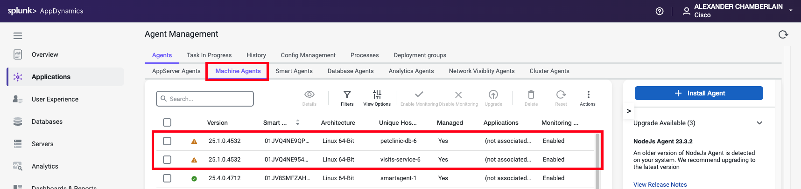
*Image 79: Agent Management screen with `visits-service-x` and `petclinic-db-x` highlighted. Waiting to be upgraded.*

1. To preform a bulk upgrade using the Appdynamics GUI, click the check box for your the respective hosts `visits-service-x` and `petclinic-db-x`. 

2. This will allow the Upgrade button to be selected. Go ahead and click to start the upgrade wizard.

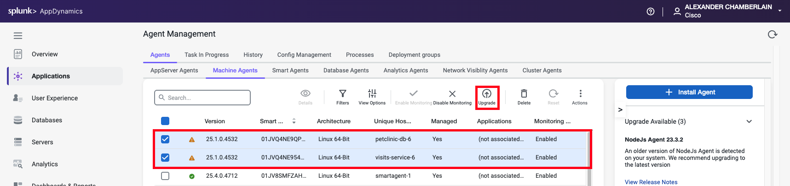
*Image 80: Agent Management screen with `visits-service-x` and `petclinic-db-x` highlighted. Waiting to be upgraded.*

### Step 3: Click through the Wizard
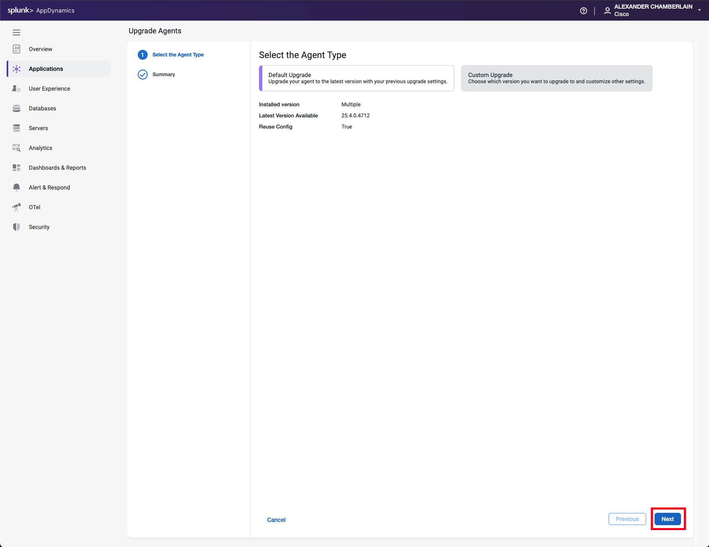
*Image 81: Upgrade Wizard - First step showing selected hosts and upgrade options*

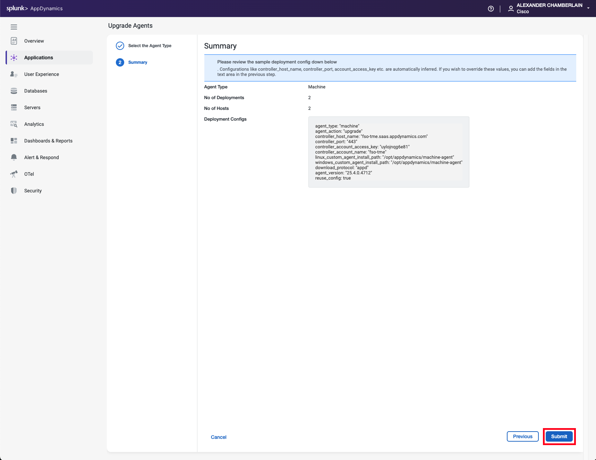
*Image 82: Upgrade Wizard - Second step showing upgrade configuration details*


### Step 4: Complete the Upgrade Process:
   * Review the summary screen that shows the selected hosts and agent type
   * Click "Next" to proceed with the upgrade
   * The system will automatically handle the upgrade process
   * You can monitor the progress in the "Tasks in Progress" section
   * Once complete, verify the new agent version in the Agent Management screen and the History Tab
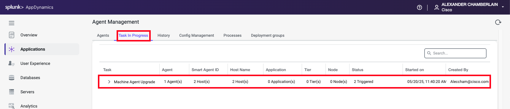
*Image 83: Upgrade Wizard - Task Progress tab showing upgrade status*

---

## Installing Java Agent Using Appd GUI

### Objective
In this lab, you will learn how to install and configure an AppDynamics Java Agent using SmartAgent, then connect it to your application for monitoring application performance.

### Prerequisites
* Access to AppDynamics Controller
* SmartAgent already installed on the target host (visits-service)
* Your assigned student number – `Petclinic-X`

### Step 1: Navigate to Agent Management


*Image 5: AppDynamics Home Screen with Agent Management tab highlighted.*


*Image 6: Agent Management screen with Manage Agents button highlighted.*

From the AppDynamics Overview Page, locate and click on the **Agent Management** tab in the top navigation bar. Then click the **Manage Agents** button.

### Step 2: Begin Java Agent Installation

In the Manage Agent screen, click the **Install Agents** button.
From the agent selection wizard, select **Java Agent**.

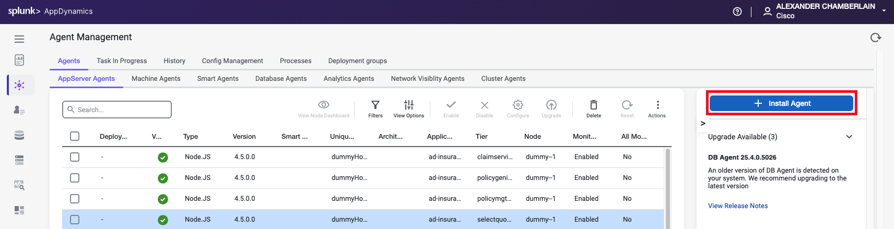
*Image 7: Install Agent wizard - AppServer Agents tab with Install Agent button highlighted.*

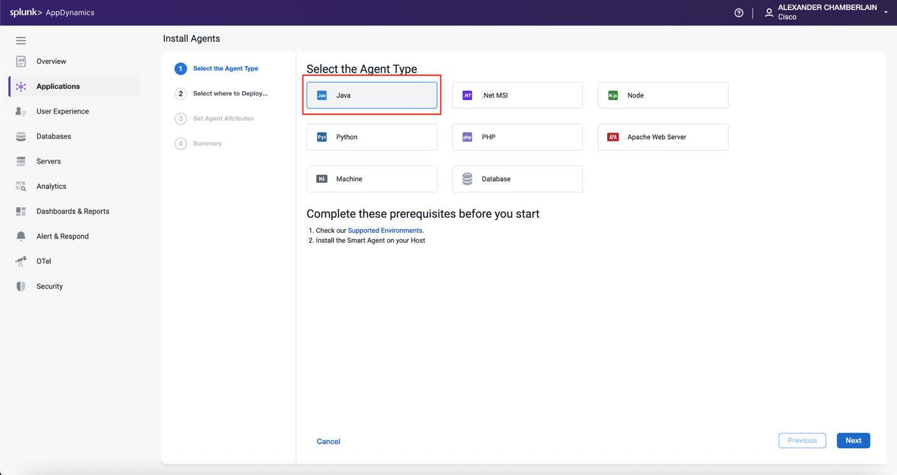
*Image 8: Install Agent wizard - Select the Agent Type: Java highlighted.*

### Step 3: Select Target Host

From the dropdown menu, select the `visits-service` host where SmartAgent is already installed.
Click the apply button to proceed with additional configurations.
Click the **Next** button at the bottom of the page to proceed.

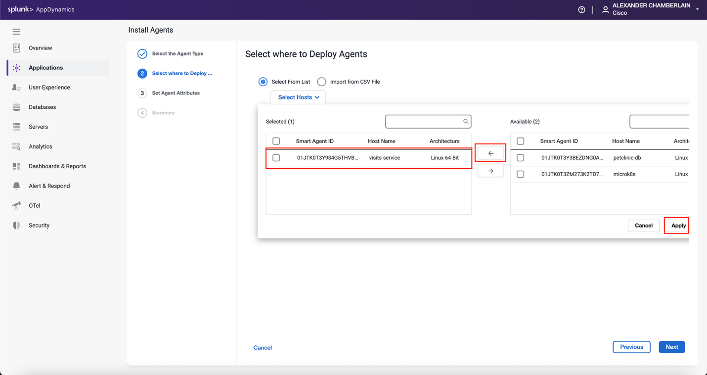
*Image 9: Install Agent wizard - Select where to Deploy Agents. `visits-service-x` host selected.*

### Step 4: Configure Java Agent App and Tier Settings

Configure your JAVA agent application App Name and Tier name similar to the below utilizing your student number – `Petclinic-X`.

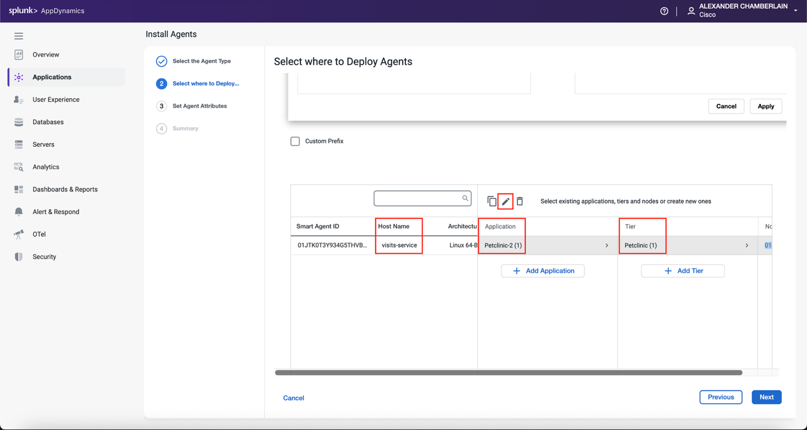
*Image 10: Install Agent wizard - Configure Application and Tier names.*

### Step 5: Configure Java Agent Settings

Configure your JAVA agent setting to be the same as what is shown in the screenshot.
Be sure to configure the correct user and group settings in the custom configuration section of the wizard. It must match what is shown in the screenshot. 

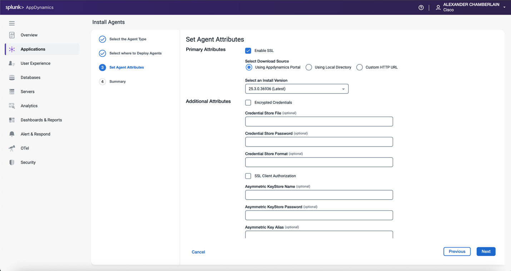
*Image 11: Install Agent wizard - Set Agent Attributes.*

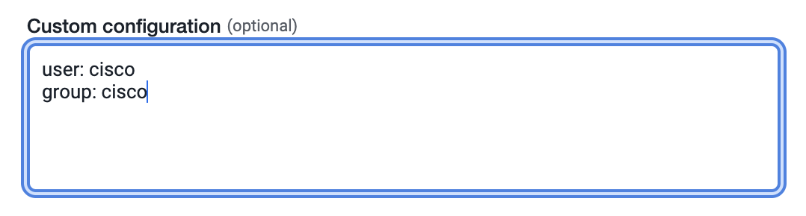
*Image 12: Install Agent wizard - Custom configuration for user and group.*

Hit **Next** to review your configuration and finally **Submit** the agent installation and wait for it to be completed. It will take some time for the installation to complete. You can watch it under the **Task in Progress** and see the Success or failure under the **History** tab.

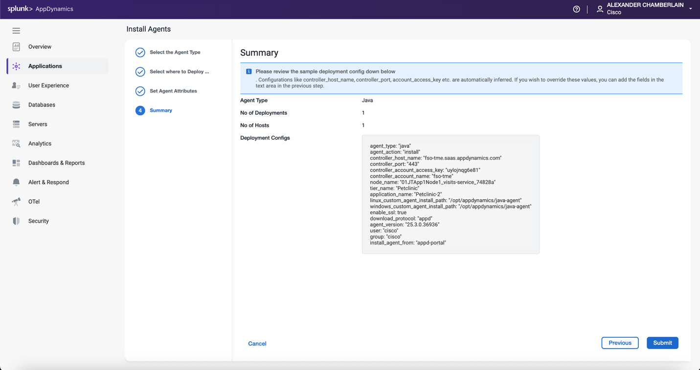
*Image 13: Install Agent wizard - Summary of Java Agent configuration.*


---

### Step 6: Restart `visits-service-x` application

1.  SSH into the `visits-service-x` node and navigate to the following directory:
    ```bash
    cd /home/cisco/spring-petclinic-microservices/deployments/hybrid/java
    ```
2.  To restart the `visits-service-x` process, locate and stop the existing Java process (if running) using:
    ```bash
    ps aux | grep java
    kill -9 <process ID>
    ```
3.  Run the service using the `run.sh` script:
    ```bash
    ./run.sh
    ```
4.  Confirm that auto-attach is working by checking the output of the script. You should see log messages indicating that the Java Agent is starting. Example:
    ```log
    [AppDynamics Agent] Agent initialization successful...
    [2025-05-07 16:52:00.828] [stderr] [info] Switching logging to the file '/var/log/appdynamics/ld_preload.log'
    [2025-05-07 16:52:00.880] [stderr] [error] Failed to set up logger: Failed opening file /var/log/appdynamics/ld_preload.log for writing: No such file or directory
    OpenJDK 64-Bit Server VM warning: Sharing is only supported for boot loader classes because bootstrap classpath has been appended
    Java 9+ detected, booting with Java9Util enabled.
    Full Agent Registration Info Resolver found system property [appdynamics.agent.applicationName] for application name [Petclinic-2]
    Full Agent Registration Info Resolver found system property [appdynamics.agent.tierName] for tier name [visits-service]
    Full Agent Registration Info Resolver found system property [appdynamics.agent.nodeName] for node name [01JTApp1Node1_visits-service_8fb61f]
    Full Agent Registration Info Resolver using selfService [true]
    Full Agent Registration Info Resolver using selfService [true]
    Full Agent Registration Info Resolver using ephemeral node setting [false]
    Full Agent Registration Info Resolver using application name [Petclinic-2]
    Full Agent Registration Info Resolver using tier name [visits-service]
    Full Agent Registration Info Resolver using node name [01JTApp1Node1_visits-service_8fb61f]
    Install Directory resolved to[/opt/appdynamics/java-agent]
    getBootstrapResource not available on ClassLoader
    Class with name [com.ibm.lang.management.internal.ExtendedOperatingSystemMXBeanImpl] is not available in classpath, so will ignore export access.
    Class with name [jdk.internal.util.ReferencedKeySet] is not available in classpath, so will ignore export access.
    [AD Agent init] Wed May 07 16:52:01 UTC 2025[DEBUG]: JavaAgent - Setting AgentClassLoader as Context ClassLoader
    [AD Agent init] Wed May 07 16:52:01 UTC 2025[INFO]: JavaAgent - Low Entropy Mode: Attempting to swap to non-blocking PRNG algorithm
    [AD Agent init] Wed May 07 16:52:01 UTC 2025[INFO]: JavaAgent - UUIDPool size is 10
    Agent conf directory set to [/opt/appdynamics/java-agent/ver25.3.0.36936/conf]
    [AD Agent init] Wed May 07 16:52:01 UTC 2025[INFO]: JavaAgent - Agent conf directory set to [/opt/appdynamics/java-agent/ver25.3.0.36936/conf]
    ```

-----

## Installing DB Using Appd GUI

### Objective

In this lab, you will learn how to install and configure an AppDynamics Database Agent using SmartAgent, then connect it to your application for monitoring database performance.

### Prerequisites

  * Access to AppDynamics Controller
  * SmartAgent already installed on the target host (`petclinic-db-x`)
  * Your assigned student number – **Petclinic-X**

### Step 1: Navigate to Agent Management

From the AppDynamics Overview Page, locate and click on the **Agent Management** tab in the top navigation bar. Then click **Manage Agents**.

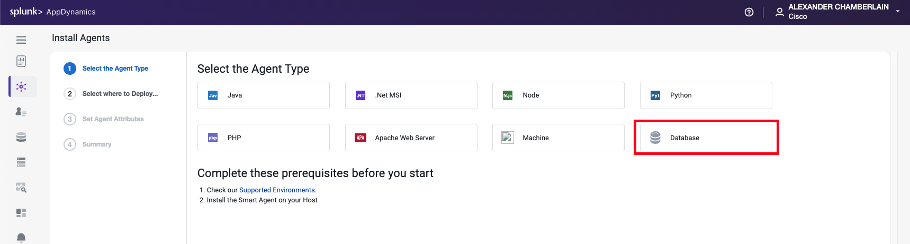
*Image 14: Install Agent wizard - Database highlighted.*


### Step 2: Begin Database Agent Installation

In the **Manage Agent** screen, click the **Install Agents** button.
From the agent selection wizard, select **Database Agent**.

### Step 3: Select Target Host

1.  From the dropdown menu, select the `petclinic-db-x` host where SmartAgent is already installed.
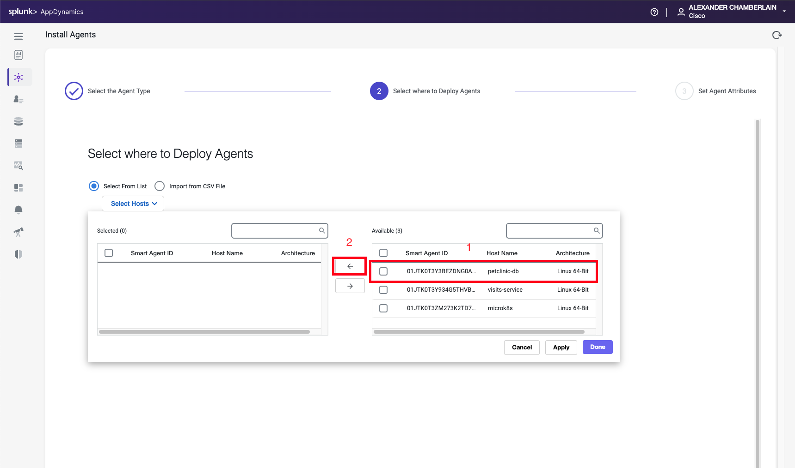
*Image 15: Install Agent wizard - Selecting the correct target host.*
2.  Click the **Next** button at the bottom of the page to proceed.
3.  Change the **Agent Name** to your student number (**Petclinic-X**) and once finished go ahead and hit the **Next** button.
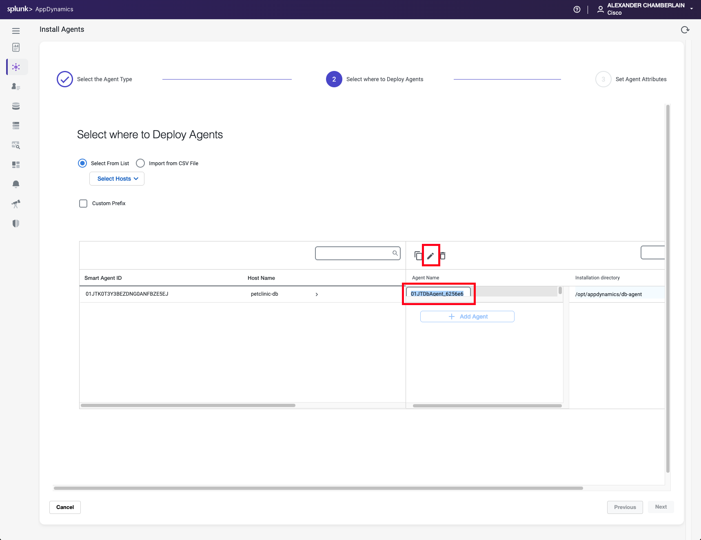
*Image 16: Changing the agent settings to match the lab environment*
4.  On the next screen we can adjust any setting needed for the application and Appdynamics monitoring environment. Be sure to match what we have configured in this screenshot. 
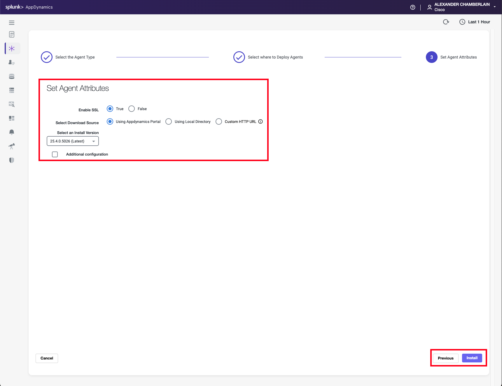
*Image 17: Changing the agent settings to match the lab environment*
Once the install has finished you'll be able to find your DB Agent you just installed. We now need to configure it as a collector for the application.

### Step 4: Configure Database Collector

1.  Locate your newly installed DB Agent in the agent list.

2.  Click on the agent to open its configuration page.

3.  Select **Add Collector** from the options.

4.  Enter the database credentials as well as matching what we have configured in the screenshot. 
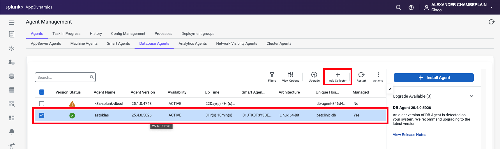
*Image 18: Selecting the correct Database agent to start collector configuration*

      * **Username**: `DBMon_Agent_User`
      * **Password**: `AppDynamicsS3cur3`

    **Note**: This user has already been created for you with the correct permissions to monitor the database. In a real implementation the creation of the user is a prerequisite.

    ```sql
    CREATE USER 'DBMon_Agent_User'@'%' IDENTIFIED BY 'AppDynamicsS3cur3';
    GRANT SELECT,PROCESS,SHOW DATABASES ON *.* TO 'DBMon_Agent_User'@'%';
    GRANT REPLICATION CLIENT ON *.* TO 'DBMon_Agent_User'@'%';
    ```
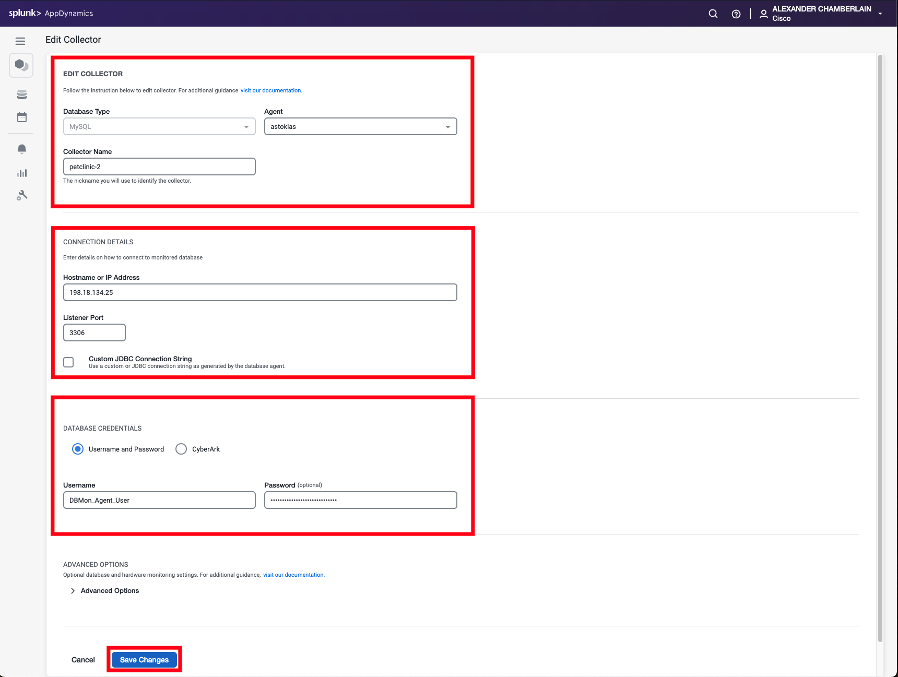
*Image 19: Defining the DB collector configuration.*
### Step 5: Link DB Agent to Application

1.  Navigate to the FlowMap for your application.
2.  Locate the database node in the flowmap. Right-click on the database node to open the context menu.
3.  Select the option to link the database node to your DB agent: **Edit Connection to Database Visibility**.
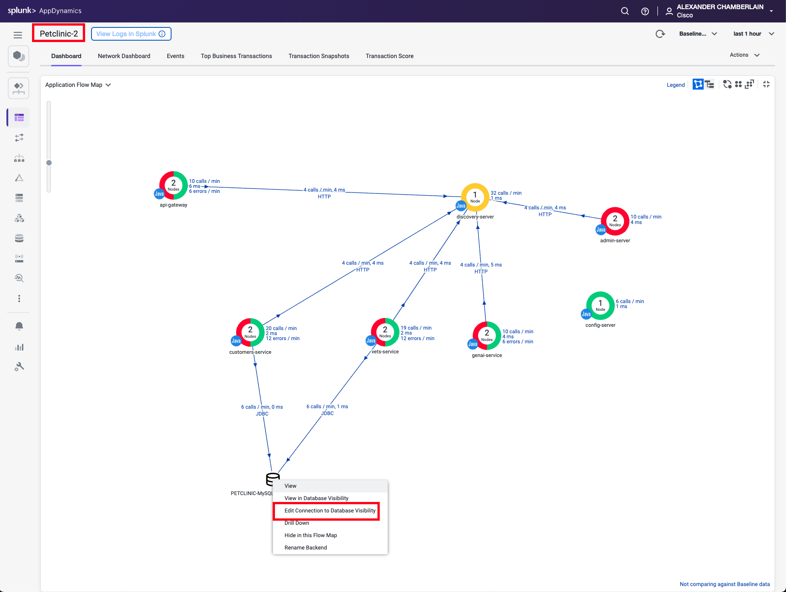
*Image 20: Starting the DB linking wizard.*
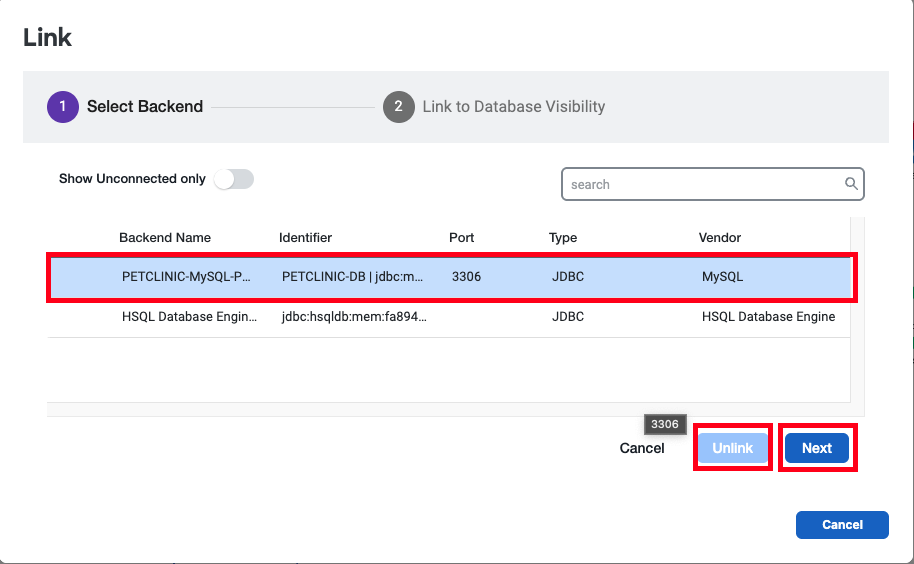
*Image 21: Defining the DB collector configuration.*
### Step 6: Complete Database Linking

1.  In the linking screen, scroll down to find your application name and student number.
2.  Select your database from the list and click **Link**.
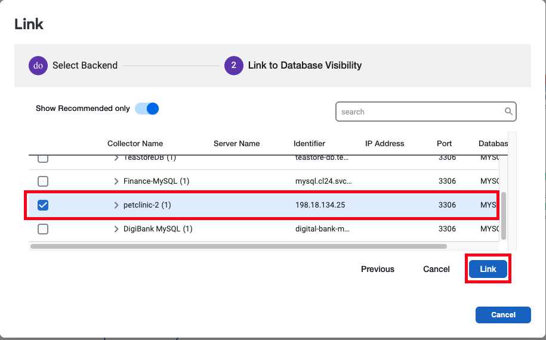
*Image 22: Finishing db linking configuration.*
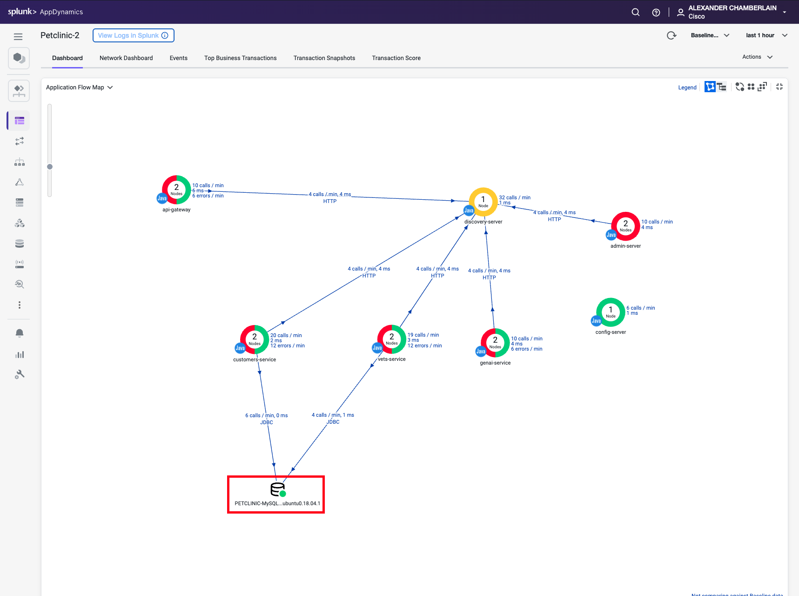
*Image 23: A successfully linked flow map, we are looking for the green dot.*
### Verification

You have now successfully:

  * Deployed the Database agent using SmartAgent
  * Configured the agent properly in the AppDynamics GUI
  * Linked the agent to your application's database

Your database should now appear in the application flowmap with proper monitoring enabled.

### Troubleshooting Tips

  * If the agent doesn't appear in the list after installation, wait 2-3 minutes for it to register.
  * Verify that the SmartAgent service is running on the host.
  * Check connection credentials if database metrics aren't appearing.


-----

## Installing Machine Agent Monitoring

When we executed the `./bulk-install-ma.sh` script, the Machine Agent was successfully installed on our two hosts: `visits-service` and `petclinic-db`. Unlike the Database Agent, we didn't need to explicitly link these Machine Agents to their respective hosts. This automatic association occurred because the hostname of each machine (`visits-service` and `petclinic-db`) precisely matched the default Node name that the Machine Agent uses.

From our Splunk Appdynamics documentation, if the hostnames of the Machine Agent and the App Server Agent (or in this case, the underlying host) do not match, it becomes necessary to manually configure the `<unique-host-id>` for the Machine Agent to be identical to that of the App Server Agent and then restart the Machine Agent. This manual step ensures that both Agents report their metrics to the same logical node within the monitoring system.

However, in our environment, the automatic linking was successful because the hostnames aligned perfectly. It's crucial to remember that the `<unique-host-id>` is **case-sensitive**, and any deviation in spelling or capitalization would necessitate the manual configuration to ensure proper metric reporting.
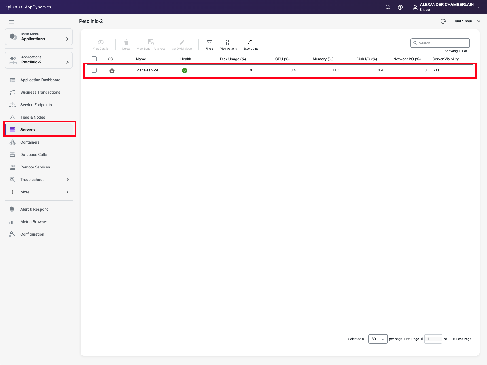
*Image 24: Showing our successfully deployed and configured machine agent*

-----

## Installing Browser Real User Monitoring (BRUM)

Browser Real User Monitoring (BRUM) also requires an agent. This agent, in the form of a JavaScript configuration and a JavaScript file, needs to be added to the webpages serving the application. For Petclinic, this is the **API-GATEWAY** service. We've already prepared the deployments for you to easily add the agent in the right place.

If you're curious and up for a challenge, stop reading and explore the resources in the `petclinic` namespace of the K8s cluster and use the developer tools in Chrome.

  * Is the AppDynamics BRUM agent (adrum) already loaded as part of the pages?
  * Is the AppDynamics BRUM agent configured, and does it send performance information?
  * How does the Agent send performance data?

### Verify the Agent

Follow these steps to determine if the AppDynamics BRUM agent (adrum) is integrated, configured, and sending performance data from your Petclinic application:

#### Step 1: Access the Petclinic Application in Your Browser

1.  Open your **Google Chrome** browser.
2.  Navigate to the URL where your Petclinic application is hosted. This will be the address of your **API-GATEWAY** service (e.g., `http://198.18.134.23:8080`).

#### Step 2: Open Chrome Developer Tools

Once the Petclinic application page has loaded, open Chrome Developer Tools. You can do this in several ways:

  * Press the **F12** key on your keyboard.
  * Right-click anywhere on the web page and select **Inspect** (or **Inspect Element**).
  * Click the three vertical dots (⋮) in the top-right corner of Chrome, go to **More tools**, and then select **Developer tools**.

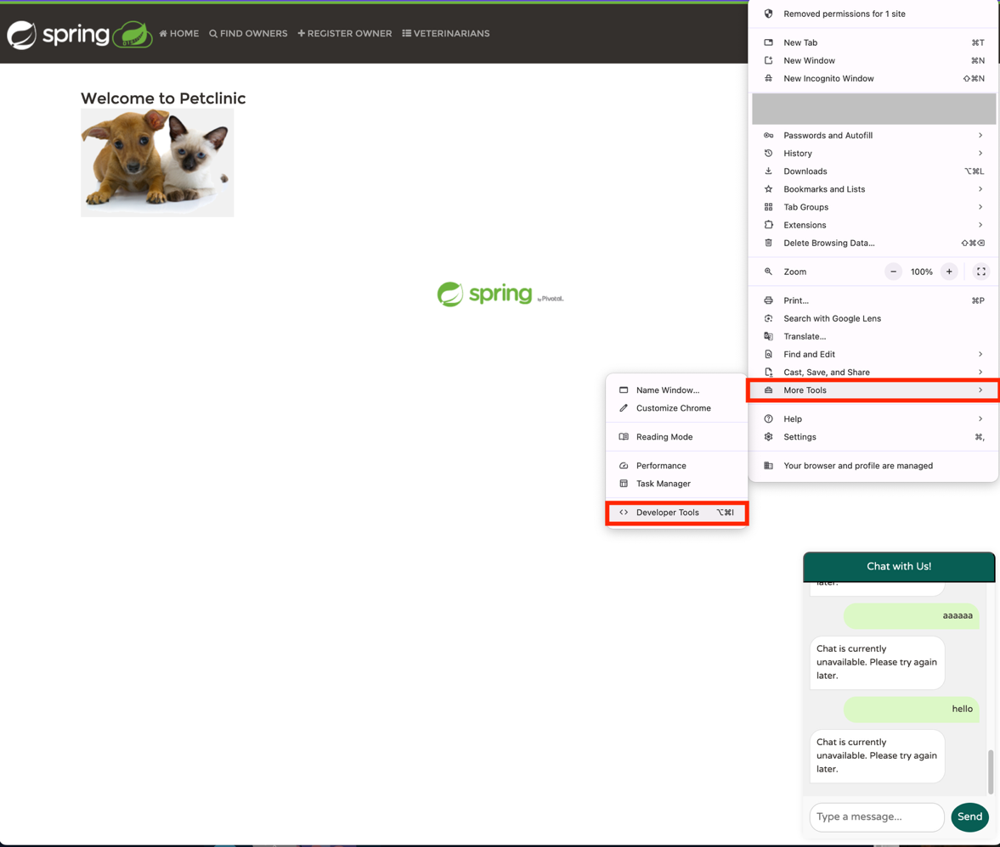
*Image 25: Getting into the browser Developer Tools*

#### Step 3: Check if the `adrum` Script is Loaded

1.  **Navigate to the "Sources" Tab**: In the Developer Tools panel, click on the **Sources** tab.
2.  **Look for `adrum` or AppDynamics Files**: Examine the list of files loaded by the page. Look for a JavaScript file with a name similar to:
      * `adrum.js`
      * `appdynamics.js`
      * A filename containing "adrum" or "appdynamics".
3.  **Alternatively, Check the "Network" Tab**:
      * Click on the **Network** tab in Developer Tools.
      * In the "Filter" box, type `adrum`.
      * If you see a request for a file containing "adrum" in the name (and the status is 200 OK), it indicates the script has been successfully loaded.
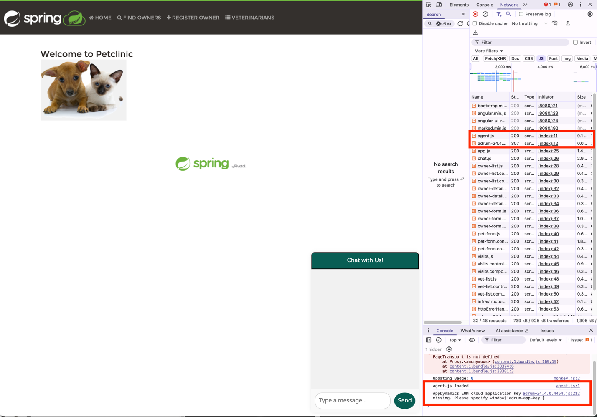
*Image 26: Checking for the `adrum` script being loaded into the webpage.*
#### Step 4: Verify Agent Configuration and Data Transmission

1.  **Navigate to the "Network" Tab** (if you aren't already there): Ensure the **Network** tab is selected in Developer Tools.
2.  **Monitor Network Requests**: Interact with the Petclinic application by navigating through different pages, clicking buttons, and filling out forms.
3.  **Filter for AppDynamics Endpoints**: In the "Filter" box of the **Network** tab, try searching for keywords related to AppDynamics, such as:
      * Your AppDynamics tenant name (if you know it)
      * `eum`
      * `beacon`
      * `metrics`
      * `adrum`
4.  **Examine Request Details**: If you find requests that seem to be going to an AppDynamics endpoint:
      * Click on the request to view its details.
      * Check the **Headers** tab to see the request and response headers.
      * Check the **Payload** or **Form Data** tab to see the data being sent. This will give you insight into the performance information being collected.

#### Step 5: Check the Console for Agent Logs

1.  Click on the **Console** tab in Developer Tools.
2.  Look for any messages or logs output by the `adrum` agent. These messages might indicate if the agent is initialized correctly, if there are any errors, or if it's successfully sending data.

By following these steps, you should be able to determine if the AppDynamics BRUM agent is present, configured, and actively transmitting performance data from your Petclinic application. Remember to interact with the application to generate network activity and potentially trigger data transmission.

-----

### Create a BRUM Application in AppDynamics ⚙️

To get a proper configuration for the ADRUM agent (see [AppDynamics Docs](https://docs.appdynamics.com/appd/24.x/latest/en/end-user-monitoring/browser-monitoring/browser-real-user-monitoring/set-up-and-access-browser-rum)), you can navigate to the AppDynamics controller and log in with your pod's credentials.

#### Step 1: Create a new BRUM Application

1.  In the AppDynamics UI, navigate to **User Experience**.
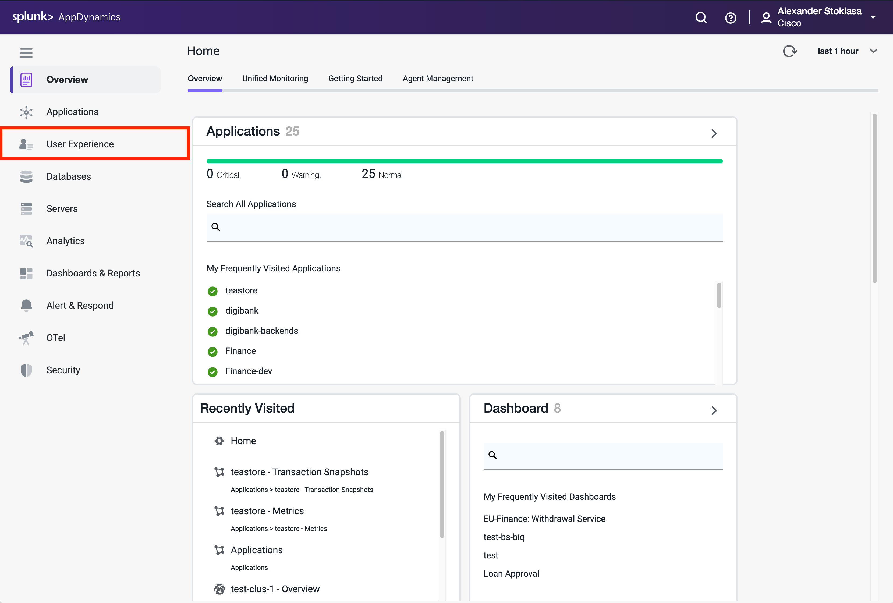
*Image 27: Navigating to create a new browser application in the Appdynamics GUI*
2.  Create a new **Browser Application** and choose **manual**.
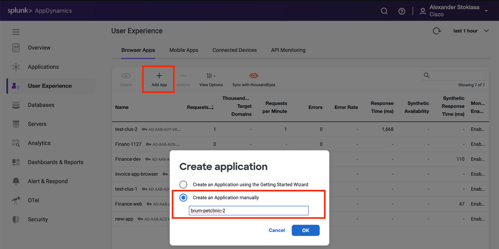
*Image 28: Navigating to create a new browser application in the Appdynamics GUI*
3.  Name the application `brum-petclinic-x` where `x` is your ID.

4.  Navigate to **Configuration** (left menu) – **Configure JavaScript Agent**.
    This will create a unique App Key for the adrum agent and will ensure performance data received from the browser will show up in your BRUM Application.

5.  Explore the UI and try to configure the advanced settings of the agent to match the following configuration. When selecting/changing options, you'll see an updated generated config in the right panel.

    ```javascript
    // ...
    config.appKey = "<YOUR APP KEY>";
    config.adrumExtUrlHttp = "http://cdn.appdynamics.com";
    config.adrumExtUrlHttps = "https://cdn.appdynamics.com";
    config.beaconUrlHttp = "http://pdx-col.eum-appdynamics.com";
    config.beaconUrlHttps = "https://pdx-col.eum-appdynamics.com";
    config.useHTTPSAlways = true;
    config.xd = {"enable":true};
    config.resTiming = {"bufSize":200,"clearResTimingOnBeaconSend":true};
    config.maxUrlLength = 512;
    config.spa = {"spa2":true};
    config.isZonePromise = true;
    config.angular = true;
    config.enableCoreWebVitals = true;
    config.enableSpeedIndex = true;
    // ...
    ```

    **Tip**: There are multiple tabs in the advanced settings; you need to change settings in each of the sections **General**, **Pages**, and **AJAX**.
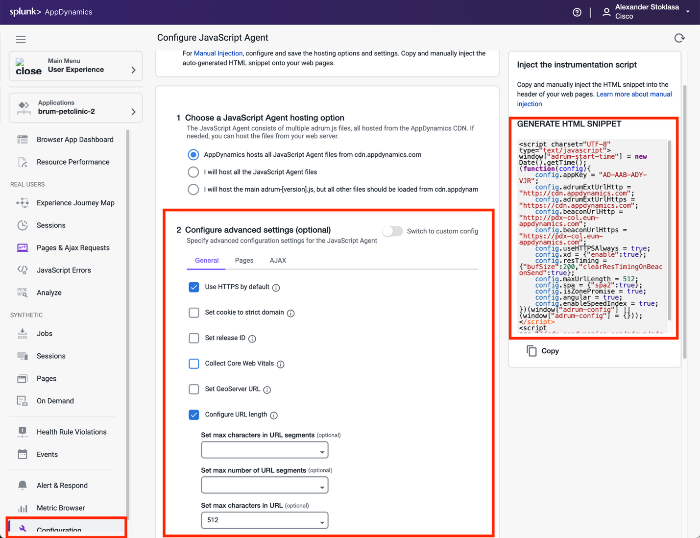
*Image 29: Viewing the different setting after creating a browser application.*
6.  Copy the final generated HTML snippet; we're going to use this in the next steps.

#### Step 2: Inject the JavaScript Agent in the application

Next, we're going to modify the WebApplication to insert the JavaScript Agent. There are many ways to achieve this. Most commonly, customers will inject the JavaScript agent using a Loadbalancer with a content rewrite policy. Or, customers do modify the source of their web application.
In this lab, we will modify the WebApplication directly.

1.  Go to your terminal session for the microk8s cluster, as the **API-GATEWAY** serving the HTML is running in the k8s cluster.
2.  In the terminal, run the following command:
    ```bash
    kubectl -n petclinic get cm
    ```
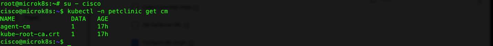
*Image 30: Looking to see what configuration maps are present in the system.*

    You can see that there is a ConfigMap called `agent-cm` which we prepared for you.
3.  Using `kubectl -n petclinic describe cm agent-cm`, we can see the current configuration.
    This script is already loaded when you access the Petclinic application; it renders the "agent.js loaded" string in the console you observed earlier. As the `adrum` agent is already loaded but missing its configuration, we're going to add the configuration into this script.

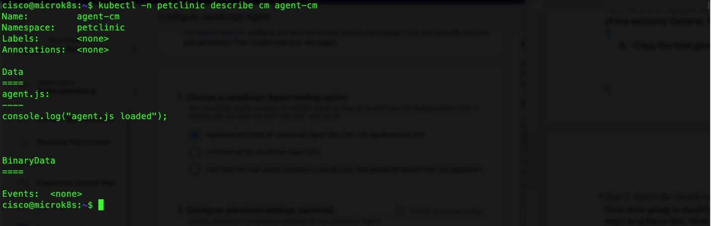
*Image 31: Describing the Kubernetes configuration map.*

4.  Edit the configmap with the following command. This will open up `vi` and you can configure the config map on the fly.

    ```bash
    kubectl -n petclinic edit cm agent-cm
    ```

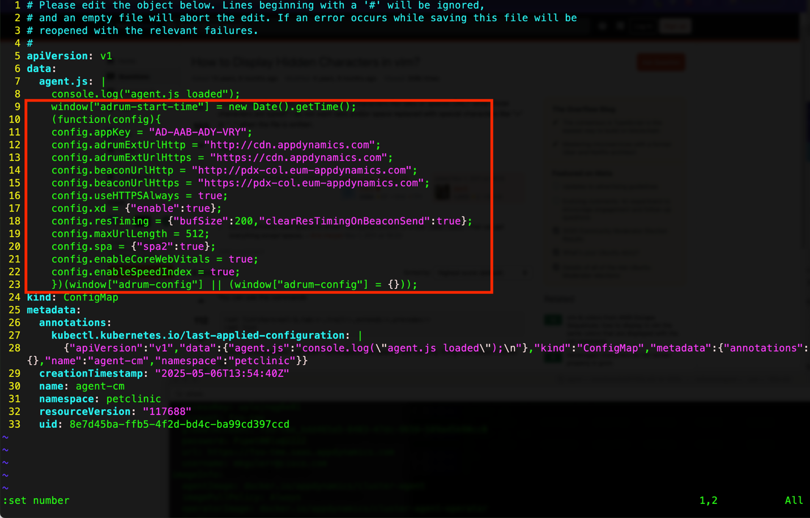
*Image 32: Editing the configuration map using Kubernetes built-in editor which is just `vi`.*

5.  From your saved agent configuration, copy everything from `window[.....` to `{})));`.
    We don't need any of the `<script>` tags as we're not embedding this in the HTML page but in a JavaScript file loaded in the webpage.
    Also ensure, that the alignment is such that everything is indented at least 2 spaces behind the `agent.js:` tag (or similar, based on your `agent-cm` structure).
6.  Hit `<esc>:wq` to save the file and verify its content.

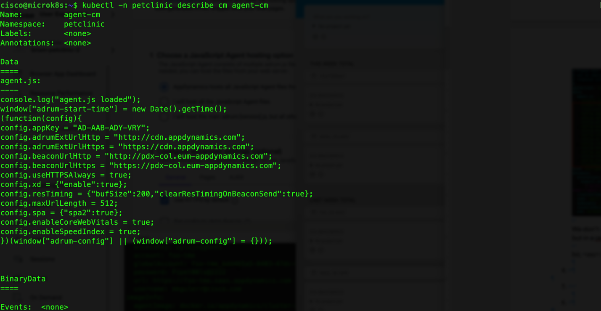
*Image 33: Checking that our edits took place by describing the configuration map again.*

#### Step 3: Restart the API-GATEWAY

In this lab, the API-GATEWAY will use the content of this configmap to create a file when the pod is created.

```bash
kubectl -n petclinic rollout restart deployment api-gateway
```

#### Step 4: Verify the operation of the agent

Reload the home page of Petclinic. In the developer tools of Chrome, after a couple of seconds, you should see an XHR request from `adrum`, sending the performance data to AppDynamics.

**Tip**: You can filter on type **Fetch/XHR** to exclude all other activity.
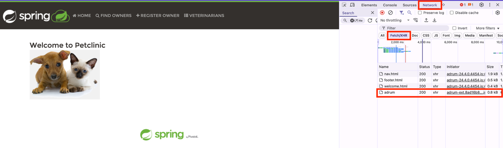
*Image 34: Using our developer tools to view that the script was successfully loaded after we made our changes.*

-----

### How does the Agent send performance data? 

The AppDynamics BRUM agent primarily sends performance data to the AppDynamics EUM (End-User Monitoring) platform using HTTP requests. Common methods include:

  * **HTTP POST requests**: This is the most common method for sending larger payloads of performance metrics and events. The data is typically formatted as JSON.
  * **HTTP GET requests**: Sometimes used for sending smaller amounts of data as query parameters in the URL.

The data sent typically includes:

  * **Page load timings**: How long it takes for different parts of a web page to load (e.g., DNS lookup, connection time, time to first byte, DOMContentLoaded, page render).
  * **User interactions**: Data about clicks, form submissions, and other user actions.
  * **JavaScript errors**: Details of any JavaScript errors that occur on the page.
  * **AJAX performance**: Timing and status of asynchronous requests.
  * **Session information**: Details about the user's browser, device, and session.

---

## Health Rule Creation 

Health rules in AppDynamics define what "normal" looks like for your environment by monitoring key metrics like response time, CPU usage, or error rates. When performance falls outside of defined thresholds, AppDynamics triggers a health rule violation, changing the status of the entity to **Warning**, **Critical**, **Normal**, or **Unknown**.

Violations trigger events that appear in the Controller UI and can initiate automated actions such as alerts or scripts via policies.

### Health Rule Types

 Type | Description |
------|-------------|
 Transaction Performance | Load, stalls, slow calls |
 Node Health - Hardware | CPU, heap, disk I/O |
 Node Health - JMX | Connection/thread pool (Java) |
 User Experience - Pages | DOM time, JS errors |
 Custom | Any collected metric |

---

### Default Health Rules

AppDynamics provides default health rules based on the entity type (e.g., applications, servers, mobile apps). You can:

* View them under **Alert & Respond > Health Rules**.
* Use, customize, or disable them as needed.
* Violations appear in yellow/orange (**Warning**) or red (**Critical**).

---

### Setup Process

1.  To begin, navigate to your **Petclinic-X Application** within the AppDynamics GUI.
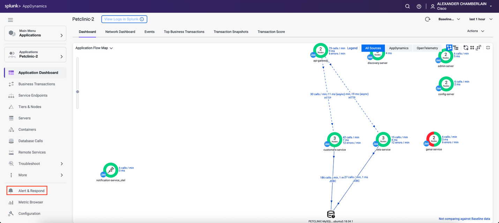
*Image 35: Navigating to the `Alert & Respond` tab in the Appdynamics GUI.*

2.  Ensure you're in the correct application and click into **Health Rules** (usually found under the "Alert & Respond" section in the left-hand navigation).
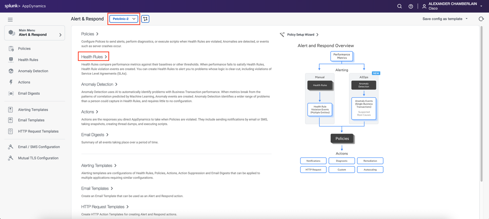
*Image 36: Clicking into the Health Rule creation wizard.*

3.  Once you're in the Health Rules creation screen for your **Petclinic-X** application, begin to create a new health rule by clicking the **+ icon** (or a "Create" button).
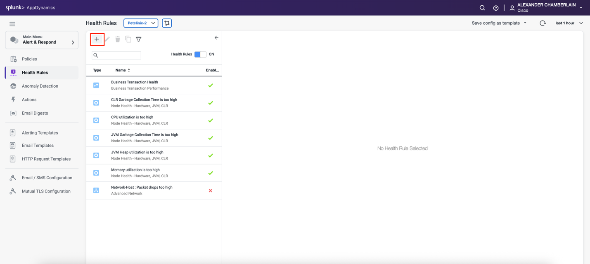
*Image 37: Creating a new health rule from the launched wizard.*

4.  Provide your Health Rule a name so that it can be identified in the system – for example, `Petclinic-X-Customer-Health-Rule`.
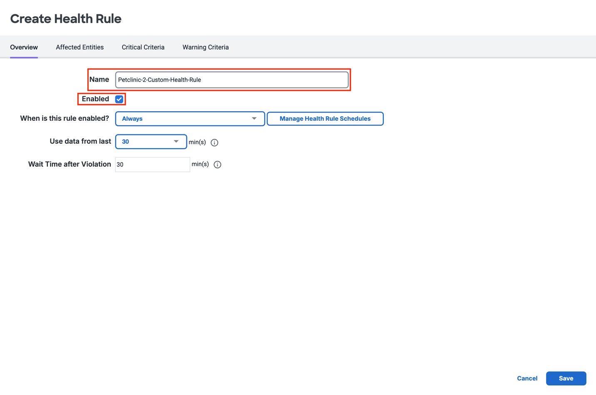
*Image 38: Naming and enabling the newly created health rule*

5.  On the **Affected Entities** tab, set a Health Rule on a specific business transaction. You will need to interact with the menus to select the appropriate configuration settings.
    * Select the type of entity the health rule will affect (e.g., "Business Transactions").
    * Specify which business transactions (e.g., "Specific Business Transactions," then choose from a list or use a matcher).
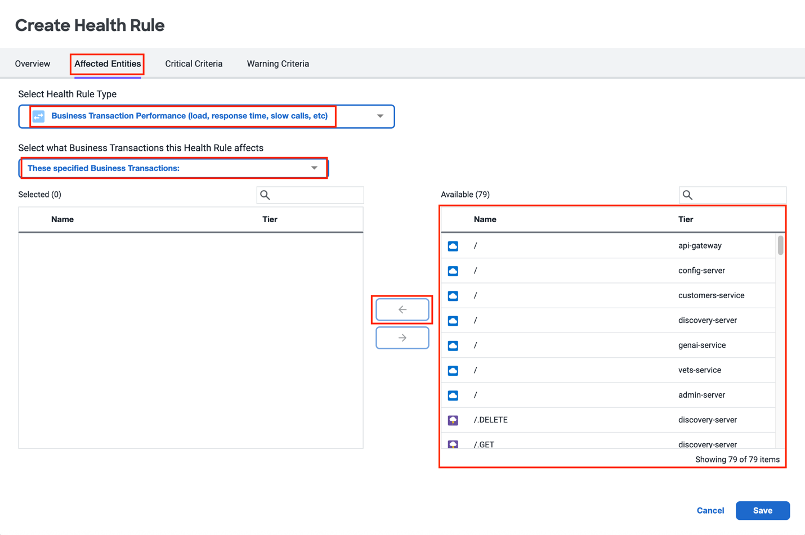
*Image 39: Choosing the correct Business Transaction to have the health rule alert*

6.  Define the **Critical Criteria** and **Warning Criteria**.
    * If you remember a Business Transaction (BT) that has some errors, that would be a good starting point. You can always duplicate your web tab to look for a meaningful BT to create a health rule for. You can sort by error.
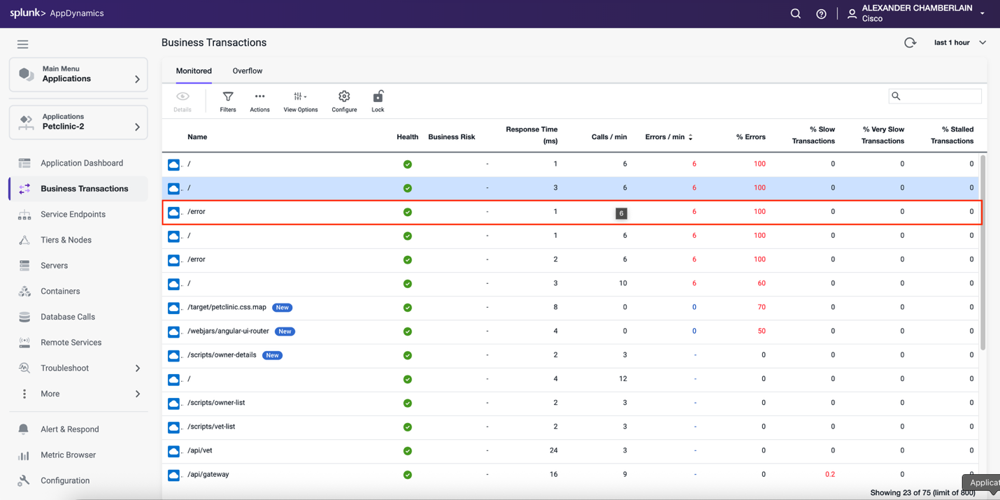
*Image 40: Showing a screenshot of the BTs and the calculated errors.*     

    * For example, create a Health Rule alerting on an error BT to notify you if the error rate goes higher than 5 errors per minute at a **Warning** Level and **Critical** if it goes above 6 errors per minute.
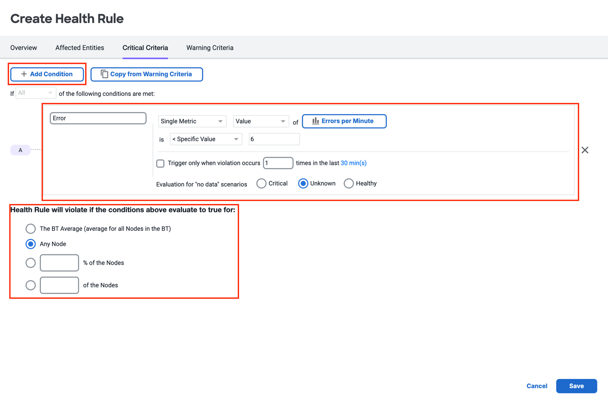
*Image 41: Selecting the appropriate `Critical` and `Warning` settings for the BT*    
    * You can configure the critical condition first, then use the **Copy From Critical Criteria** button for the warning condition and adjust the values.


7.  Once finished, save the health rule. You should see the newly created health rule in the list.
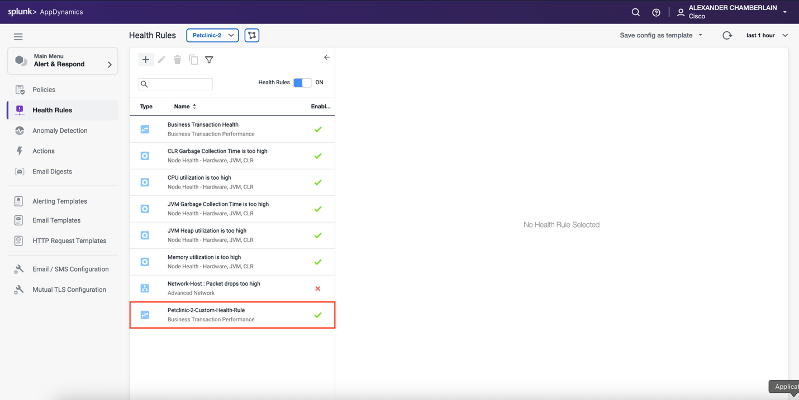
*Image 42: Showing a successfully created health rule after the wizard is completed.*  
8.  Since the health rule is configured to alert based on data being sent into the system, after some time and if the conditions are met, you will see an alert on the BT.
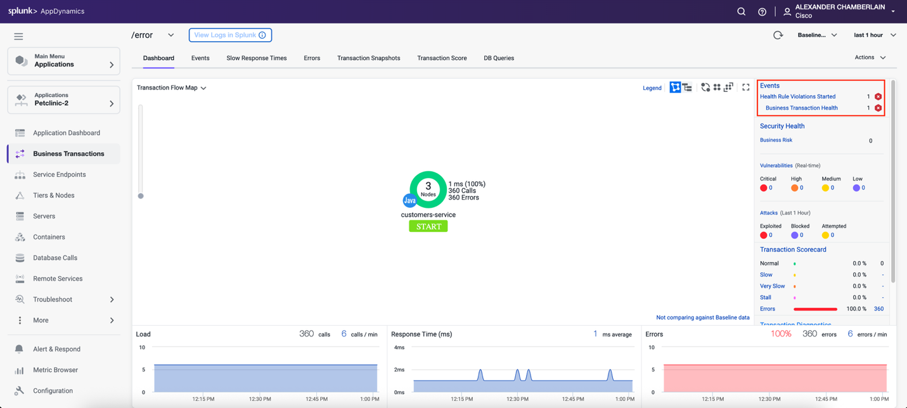
*Image 43: Highlighting where the Health Rule alert will appear within the Appdynamics GUI*  
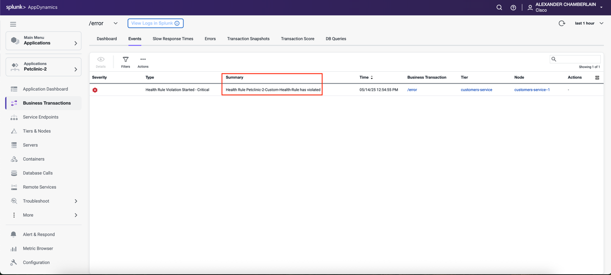
*Image 44: Highlighting the Health Rule Alerting showing our custom Health Rule*

---

## Business Transaction Detection & Refinement
*Estimated Time: 30 minutes*

<!-- 
============================================================================
                    FINDING MISSING BUSINESS TRANSACTIONS
============================================================================
-->

### Finding Missing Business Transactions

#### Background

AppDynamics doesn't always discover all business transactions automatically. Common reasons include:

* Activities in unsupported frameworks
* Background tasks or scheduled jobs
* Custom frameworks without standard entry points
* Non-HTTP protocols without specific instrumentation
* Internal method calls that should be tracked as separate BTs

In this exercise, we'll identify and create a business transaction for background activities in the Spring Eureka Discovery Client, which typically isn't captured automatically.

#### Step 1: Access the Live Preview Feature

1. Navigate to your application in the AppDynamics Controller
2. From the left navigation menu, select **Configuration**
3. Open the **Application Configuration Settings**
   
   > **Important**: Ensure you're working with **your assigned application** (Petclinic-X)

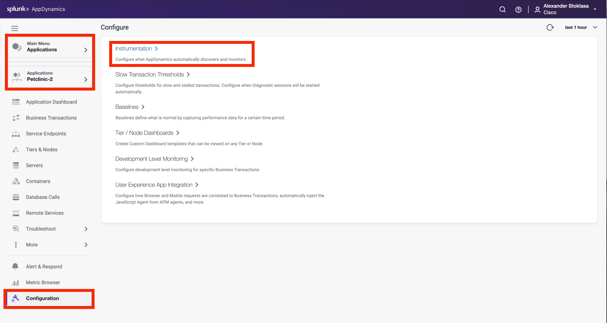
*Image 45: Navigating to the Application Configuration Settings screen*

4. Select **Transaction Detection** from the left menu
5. Click on the **Live Preview** tab

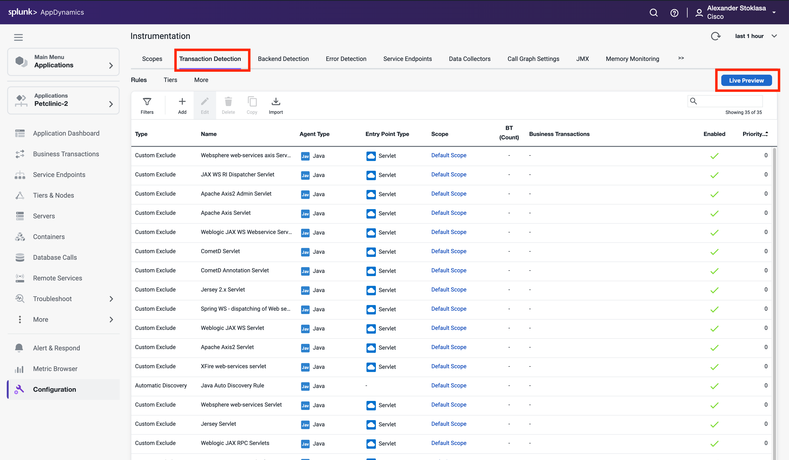
*Image 46: Highlighting the Live Preview tab under Transaction Detection*

**Expected Outcome**: You should see the Live Preview interface with options to start a discovery session.

#### Step 2: Start a Discovery Session

1. Click the **Start Discovery Session** button
2. In the node selection dialog:
   * Select the **"visits-service"** Tier
   * If multiple nodes appear, select the one with the green checkmark (there should be just one)
   * Click **OK** to begin the discovery session

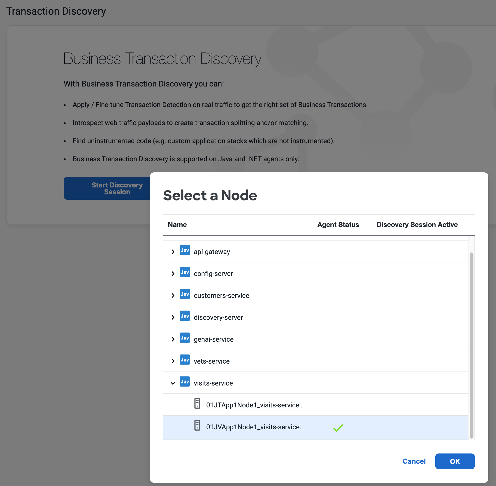
*Image 47: Selecting the correct node to configure Live Preview*

**What's Happening**: The agent is now entering "Discovery Mode" and will report back activities in the application that aren't currently mapped to business transactions. This includes HTTP calls, database interactions, and method executions that might be good candidates for custom business transactions.

> **Note**: Discovery mode collects data for a limited time and requires active transactions in your application. You may need to generate some traffic or wait a few minutes for results to appear.

**Expected Outcome**: After a few minutes, the Live Preview screen should populate with data about potential business transactions.

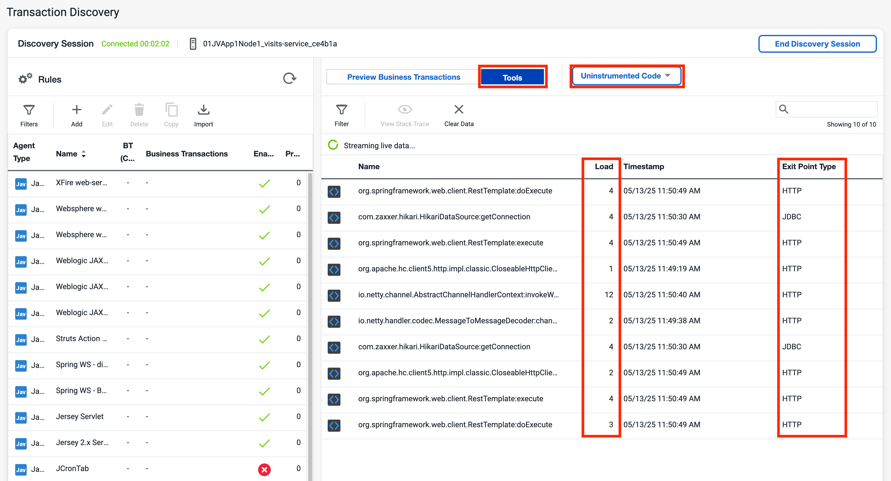
*Image 48: Live Preview discovery results showing potential business transactions*

#### Step 3: Analyze Discovery Results and Select a Candidate

1. In the discovery results, look for entries related to background service discovery activity
2. Locate and double-click on an entry that looks like `org.springframework.web.client.RestTemplate:doExecute`
   * This class is commonly used in Spring microservices for making HTTP requests, including service registry heartbeats

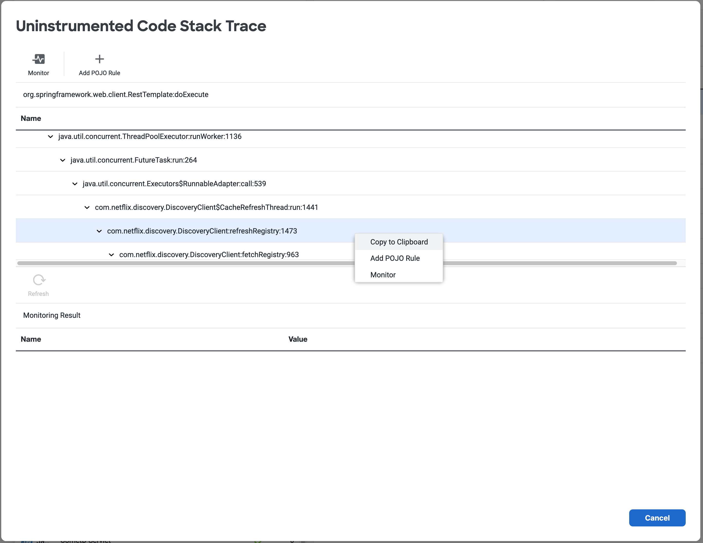
*Image 49: Selecting an entry from the discovery results*

**Expected Outcome**: A stack trace will be displayed showing the call hierarchy for this method execution.

#### Step 4: Create a POJO Rule for the Background Activity

1. In the stack trace view, scroll down until you see classes from the Netflix Eureka library
   * Look for something like `com.netflix.discovery...` in the stack
   * These classes handle service registration and discovery in Spring Cloud applications

2. Find a method that represents a meaningful operation, such as:
   * `refreshRegistry` - Updates the local registry with the latest service information
   * `renew` - Sends a heartbeat to the registry to maintain registration

3. Right-click on this method line in the stack trace and select **"Add POJO Rule"**

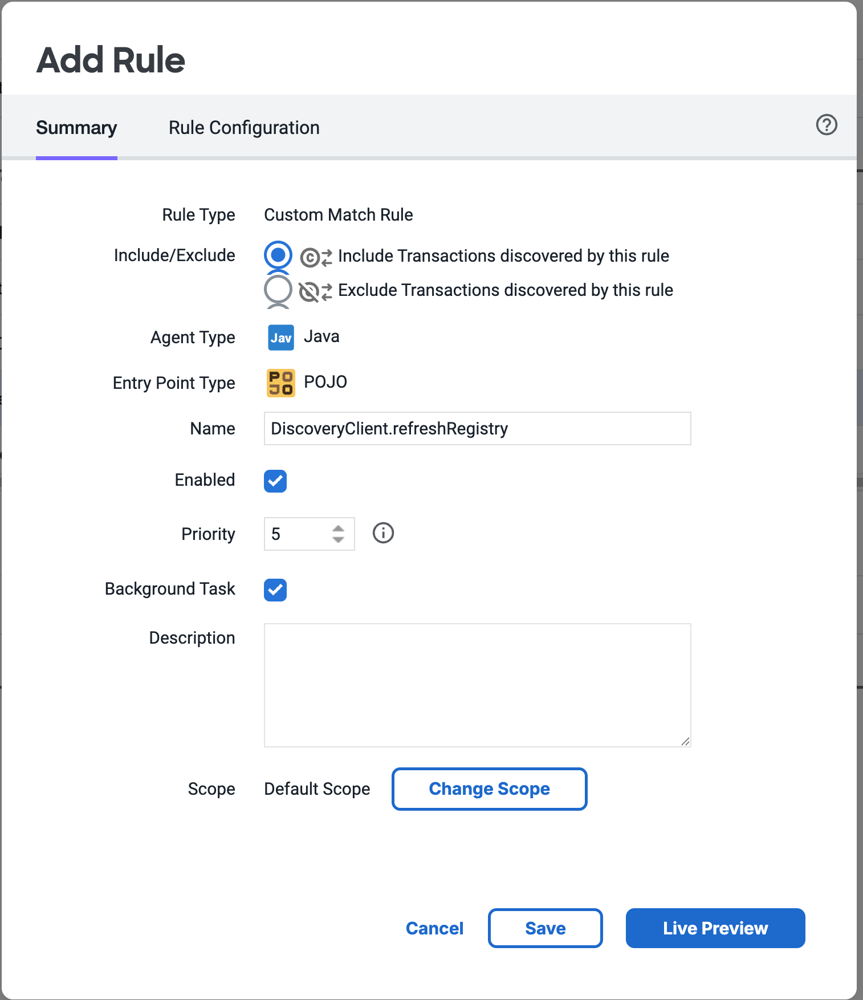
*Image 50: Right-clicking to add a POJO Rule from the stack trace*

**Expected Outcome**: The POJO Rule configuration dialog will open with some fields pre-populated based on your selection.

#### Step 5: Configure the POJO Transaction Rule

In the configuration dialog, set the following options:

1. **Rule Name**: Enter a descriptive name that identifies the purpose
   * Example: `VisitsService-DiscoveryClient-Refresh`
   * Good naming convention: `[Tier]-[Component]-[Action]`

2. **Entry Point Type**: Verify that POJO is selected

3. **Class Name**: This should be pre-filled with the selected class
   * Example: `com.netflix.discovery.DiscoveryClient`

4. **Method Name**: This should be pre-filled with the selected method
   * Example: `refreshRegistry` or `renew`

5. **Transaction Naming**: Leave at the default "Method Name" option for simplicity

6. **End-to-End Transaction Assembly**: Ensure **"Execute method in a new transaction"** is selected
   * This creates a standalone BT rather than making it part of an existing transaction

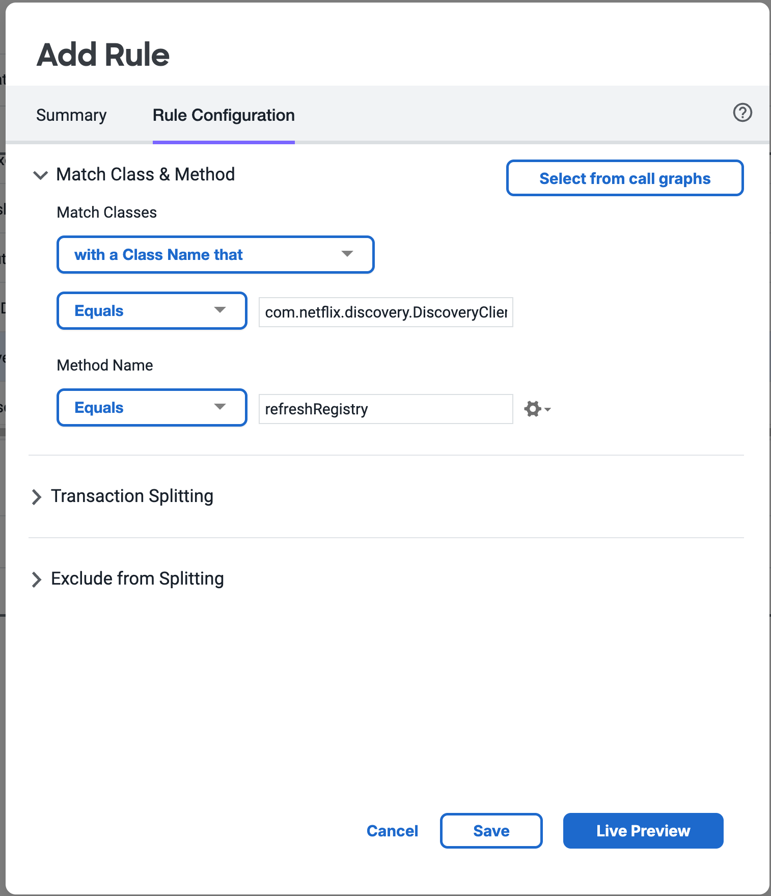
*Image 51: Configuring the POJO Rule settings*

7. Click **Save** to create the rule

**Expected Outcome**: The rule will be saved and you'll return to the previous screen or a configuration summary.

> **Important**: If you're returned to another configuration screen after saving, you can click **Cancel** as your rule has already been saved.

#### Step 6: Verify Your New Business Transaction

1. In the Live Preview screen, click **"Preview Business Transactions"**
2. Wait briefly while the system processes the new rule and detects matching transactions
3. Look for your newly created transaction in the list of business transactions

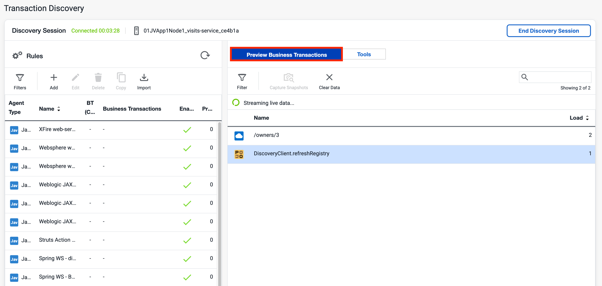
*Image 52: Previewing the newly created business transaction*

**Expected Outcome**: You should see your new POJO-based business transaction in the list, indicating that the rule is working correctly.

#### Validation Steps

To ensure your business transaction is properly configured and monitored:

1. Exit the Live Preview mode by clicking **Done** or navigating back to the main Business Transactions screen
2. Wait for 3-5 minutes for the agent to apply the new configuration
3. Navigate to **Business Transactions** in the left menu
4. Search for your newly created transaction (e.g., "refreshRegistry" or your custom name)
5. Verify that the transaction appears in the list with performance metrics

**Success Criteria**: The transaction appears in the business transactions list and shows call counts, average response time, and other metrics.

<!-- 
============================================================================
                    TROUBLESHOOTING & BEST PRACTICES
============================================================================
-->

### Troubleshooting Tips

If your new business transaction doesn't appear:

* **Check the class and method names**: Ensure they exactly match what's in your application code
* **Generate traffic**: Background operations may run on a schedule - wait long enough for them to execute
* **Verify agent connectivity**: Check that the agent is online and communicating with the controller
* **Examine logs**: Look for any errors in the agent logs related to POJO instrumentation
* **Check rule priority**: If you have conflicting rules, ensure your new rule has appropriate priority

If the transaction appears but doesn't collect data:

* **Method execution frequency**: Some background methods execute rarely - verify the execution schedule
* **Method signature mismatch**: Confirm the exact method signature (parameters, return type)

-----

## Stop Detecting Business Transactions
*Estimated Time: 15 minutes*

### Overview

Equally important as detecting new business transactions is the ability to ignore entry points for business transactions. This step is crucial for maintaining a clean, focused monitoring environment that tracks only meaningful application activity.

In this section, you will learn how to:
- Create exclusion rules for business transactions
- Delete existing unwanted business transactions
- Verify that exclusions are working correctly

### Why Exclude Business Transactions?

Not all activities in your application need monitoring. Common examples of transactions to exclude:

- **Health Check Endpoints**: Such as `/actuator/health` which create noise but offer little monitoring value
- **Static Resource Requests**: Like CSS, JavaScript, or image files
- **Background Jobs**: That run on a schedule and don't represent user activity
- **Internal API Calls**: Between microservices that don't represent complete business processes

### Creating Business Transaction Exclusion Rules

There are multiple ways to achieve this. For single transactions, the **"Exclude Transaction"** context menu is convenient. For broader exclusions, we'll use the Transaction configuration. In this exercise, we're going to exclude all `/actuator/…` Business Transactions, as they are health check endpoints that don't provide business value for monitoring.

#### Step 1: Navigate to Transaction Detection Configuration

1. Go to your application in the AppDynamics Controller
2. In the left navigation menu, click on **Configuration**
3. Select **Instrumentation** 
4. Click on **Transaction Detection**

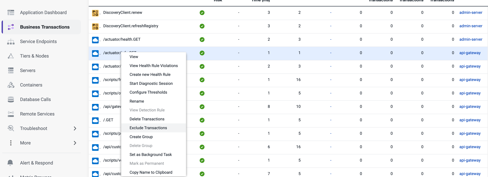
*Image 53: Navigating to Transaction Detection configuration* 

#### Step 2: Create a Custom Exclusion Rule

1. Click the "+" icon to create a new **Custom Match Rule**
2. In the dropdown, select **Java-Servlet** as the type

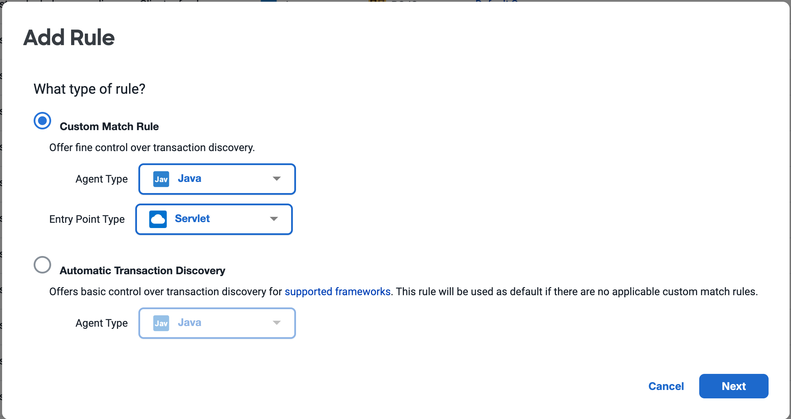
*Image 54: Adding an exclusion rule* 

3. Configure the rule with the following details:
   * **Rule Name**: Enter `Exclude Actuator Endpoints`
   * **Priority**: Leave as default (usually 0 or auto-assigned)
   * **Enabled**: Ensure this checkbox is selected
   * **Action**: Select **Exclude Transaction** from the dropdown

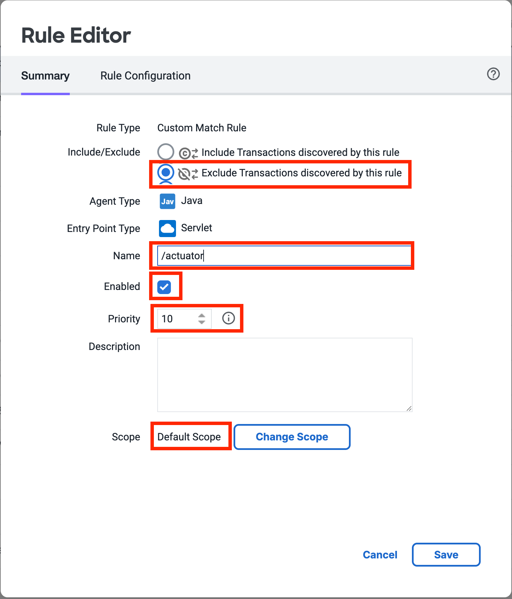
*Image 55: Configuring the exclusion rule*

4. In the **HTTP Request Data** section:
   * For **URI** option: Set to match `/actuator/**` 
   * **Match**: Select **Equals** or **Starts With** as appropriate
   * You can leave other fields at their default values

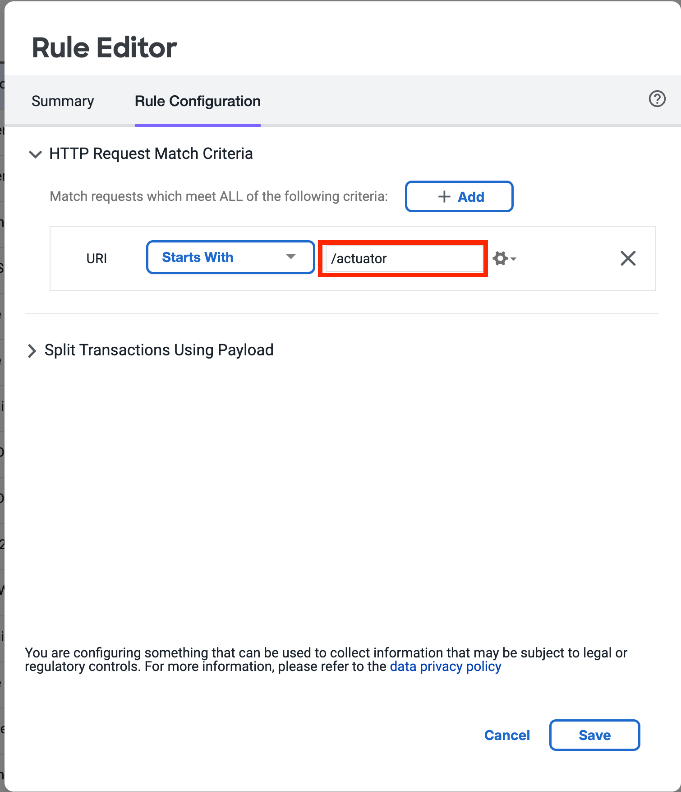
*Image 56: Configuring the HTTP URI match criteria* 

5. Click **Save** to create the rule

#### Step 3: Clean Up Existing Transactions

The exclusion rule will prevent new `/actuator` transactions from being created, but existing ones will remain until deleted:

1. In the left navigation menu, click on **Business Transactions**
2. In the search box, type `/actuator` and press Enter
3. Select all shown Business Transactions related to `/actuator` by checking their boxes

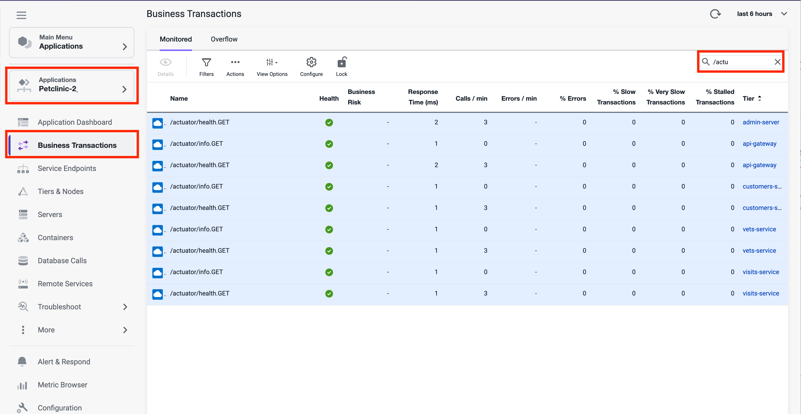
*Image 57: Searching for /actuator business transactions*

4. Right-click on any selected transaction and select **"Delete Transactions"**
5. Confirm the deletion when prompted

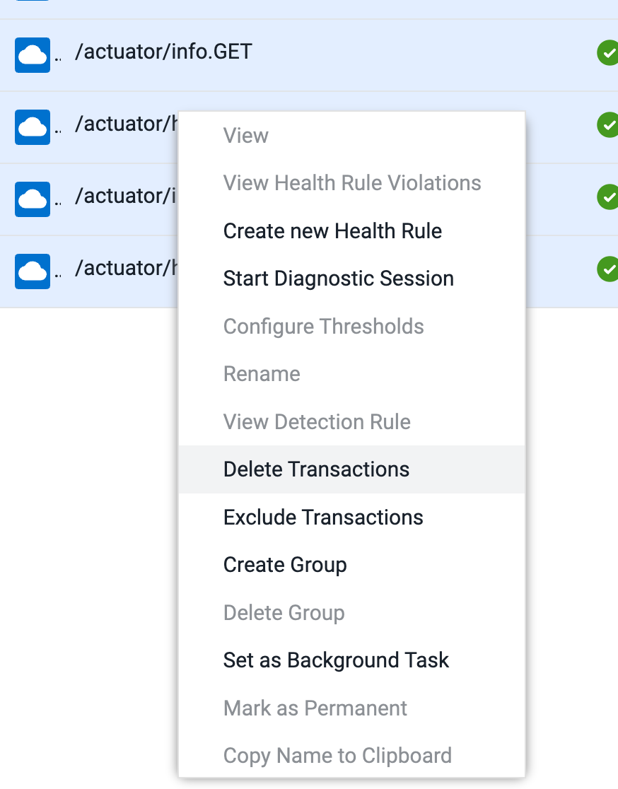
*Image 58: Deleting unwanted business transactions*

### Validation Steps

To verify your exclusion rule is working correctly:

1. After configuring the exclusion rule and deleting existing transactions, generate some traffic to the application
2. Wait 2-3 minutes for the agent to process the traffic
3. Return to the **Business Transactions** list
4. Search for `/actuator` again
5. **Success criteria**: No business transactions matching `/actuator/**` should appear in the list

### Troubleshooting Tips

If actuator transactions continue to appear after creating the exclusion rule:

* **Check Rule Priority**: Ensure your exclusion rule has a higher priority (lower number) than any inclusion rules
* **Verify URI Pattern**: Make sure the pattern correctly matches all relevant URLs
* **Rule Enabled**: Confirm the rule is enabled (checkbox is selected)
* **Agent Restart**: In some cases, you may need to restart the agent for changes to take effect
* **Check Controller Sync**: Verify the agent has synchronized with the controller by checking the Agent Status

### Why Not Just Delete Transactions?

This is a good question. Deleting business transactions without an exclusion rule only provides a temporary solution. Here's why:

* If an agent discovers that business transaction again after deletion, it will be re-created
* Deleting a BT will solve the problem temporarily, but the transaction will reappear when the endpoint is called again
* Only exclusion rules ensure that these entry points will be permanently ignored

Using a combination of exclusion rules and deletion provides the most effective solution:
* **Exclusion rule**: Prevents future detection
* **Deletion**: Cleans up existing transactions

### Additional Information

* Exclusion rules can be created for other transaction types beyond HTTP servlets
* Rules can use complex pattern matching including regular expressions for more granular control
* You can create multiple exclusion rules for different types of endpoints
* The rule changes apply only to the specified application

-----

## Log Observer Connect

Splunk Log Observer Connect for Cisco AppDynamics enriches the application logs with metadata specific to Splunk AppDynamics SaaS. To view logs in Splunk Platform in context of an application monitored by Splunk AppDynamics SaaS, you must integrate Splunk AppDynamics SaaS with Splunk Cloud Platform or Splunk Enterprise, depending on your deployment. Using the deep links on the Controller UI, you can directly navigate from Splunk AppDynamics SaaS to Splunk Platform with a single sign-on and view the logs corresponding to the application, tier, node, business transaction, and transaction snapshot. With logs, you can further drill down to identify the root cause and the source of an issue and then initiate remediation actions.

The following steps are required to enable the Integration:

  1. Configure Splunk Service Account User (already done for this lab).
  2. Configure Universal Forwarder or Splunk OTel Distribution to send logs.
  3. Configure Splunk AppDynamics Agents & Application.
  4. Configure Splunk AppDynamics for metadata enrichment (already done for this lab).

### Visits-Service Node

Integrating AppDynamics Log Observer requires a configured Splunk Universal Forwarder to send log data to your Splunk instance. To simplify this, a script has been written that automates the installation and configuration of the Universal Forwarder, ensuring it monitors the correct logs and connects to your Splunk environment.

It's important to understand that while the AppDynamics metadata is already configured here, a production setup would involve modifying your logging framework, commonly through changes to your `log4j.xml` file (or similar like `logback.xml`), to properly support the addition of this metadata.

For structured logs, AppDynamics Log Observer automatically includes these key MDC (Mapped Diagnostic Context) values in the log object:

  * `appd_node_id`: Identifies the originating application node.
  * `appd_bt_id`: Links the log to a specific Business Transaction.
  * `appd_request_guid`: Tracks individual requests within a Business Transaction.

Including these MDC keys in your structured logs enables Log Observer to provide immediate application context for more efficient analysis and troubleshooting.

-----

### Installing and Configuring Splunk UF

#### Step 1: Navigate to the `splunk_loc` directory

From the root `spring-petclinic-microservices` directory, change to the `splunk_loc` directory.

```bash
cd spring-petclinic-microservices/
cd splunk_loc/
ls
```

Expected output (or similar):

```
splunkclouduf.spl  splunkforwarder-9.4.2-e9664af3d956-linux-amd64.deb
```

#### Step 2: Look at the provided installation files

To help configure the UF, we have made use of the Universal Forwarder app that exists on the Splunk Enterprise instance. This provides files (`outputs.conf` and keys) that can be used to configure the UF to interact with your Splunk Cloud instance. We are basically following the UF installation guide:
[Splunk Universal Forwarder Installation Guide](https://docs.splunk.com/Documentation/Forwarder/9.4.1/Forwarder/Installanixuniversalforwarder)

Extract the Splunk Cloud UF package:

```bash
tar xvf splunkclouduf.spl
```

This will create a directory structure similar to:

```
100_scv-shw-12cdc3a9c00cff_splunkcloud/
100_scv-shw-12cdc3a9c00cff_splunkcloud/local/
100_scv-shw-12cdc3a9c00cff_splunkcloud/local/outputs.conf
100_scv-shw-12cdc3a9c00cff_splunkcloud/default/
100_scv-shw-12cdc3a9c00cff_splunkcloud/default/limits.conf
100_scv-shw-12cdc3a9c00cff_splunkcloud/default/outputs.conf
100_scv-shw-12cdc3a9c00cff_splunkcloud/default/scv-shw-12cdc3a9c00cff_cacert.pem
100_scv-shw-12cdc3a9c00cff_splunkcloud/default/scv-shw-12cdc3a9c00cff_server.pem
```

Navigate into the directory to see the files:

```bash
cd 100_scv-shw-12cdc3a9c00cff_splunkcloud/default # Or similar directory name
pwd
```

Output example:

```
/home/cisco/spring-petclinic-microservices/splunk_loc/100_scv-shw-12cdc3a9c00cff_splunkcloud/default
```

List files:

```bash
ll # or ls -l
```

Expected output (or similar):

```text
total 36
drwx------ 2 cisco cisco 4096 May  8 14:47 ./
drwx------ 4 cisco cisco 4096 May  8 14:47 ../
-rw------- 1 cisco cisco  235 May  8 14:47 limits.conf
-rw------- 1 cisco cisco 1942 May  8 14:47 outputs.conf
-rw------- 1 cisco cisco 4908 May  8 14:47 scv-shw-12cdc3a9c00cff_cacert.pem
-rw------- 1 cisco cisco 8975 May  8 14:47 scv-shw-12cdc3a9c00cff_server.pem
```

#### Step 3: Proceed with the Install

1. Login as **ROOT** to the machine on which you want to install the universal forwarder.
   ```bash
   sudo -i
   ```

2. Add the user (it may already be added):
   ```bash
   useradd -m splunkfwd
   groupadd splunkfwd
   ```

3. Install the Splunk software. Create the `$SPLUNK_HOME` directory wherever desired.
   ```bash
   export SPLUNK_HOME="/opt/splunkforwarder"
   mkdir $SPLUNK_HOME
   ```
4.  Now install the UF package. Change to the `splunk_loc/` directory (as root, double-check your current directory).
    ```bash
    # Ensure you are in the correct directory as root
    # Example: root@visits-service:/home/cisco/spring-petclinic-microservices/splunk_loc# pwd
    # /home/cisco/spring-petclinic-microservices/splunk_loc

    dpkg -i splunkforwarder-9.4.2-e9664af3d956-linux-amd64.deb
    ```
    Output will show unpacking and setup:
```text
Selecting previously unselected package splunkforwarder.
(Reading database ... 131409 files and directories currently installed.)
Preparing to unpack splunkforwarder-9.4.2-e9664af3d956-linux-amd64.deb ...
no need to run the pre-install check
Unpacking splunkforwarder (9.4.2) ...
Setting up splunkforwarder (9.4.2) ...
find: '/opt/splunkforwarder/lib/python3.7/site-packages': No such file or directory
find: '/opt/splunkforwarder/lib/python3.9/site-packages': No such file or directory
Complete
```
5.  Change ownership:
    ```bash
    chown -R splunkfwd:splunkfwd /opt/splunkforwarder
    ```
6.  Start the Splunk Forwarder, accept the license, and create an admin user. **PLEASE REMEMBER THIS USER, YOU MIGHT NEED IT LATER.**
    ```bash
    /opt/splunkforwarder/bin/splunk start 
    ```
    Follow the prompts to create an admin username and password.
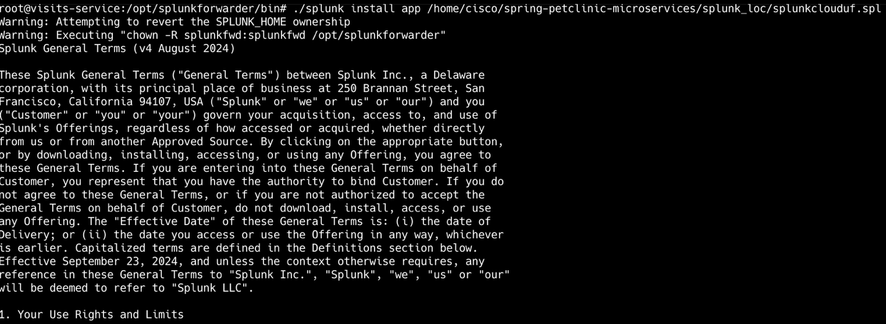
*Image 59: Output of the licenses that needs accepting go and head proceed to the end. **You need to remember the username and password you create at this step.***

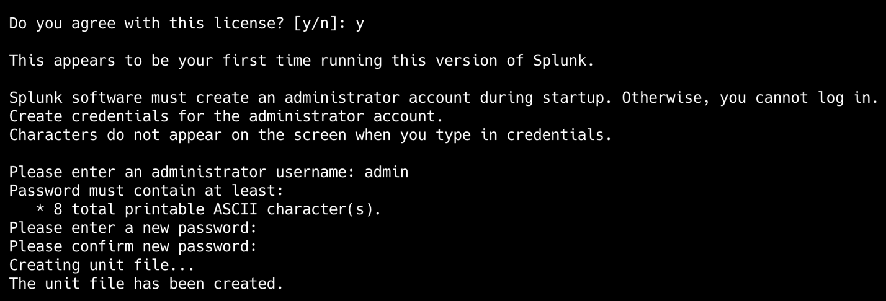
*Image 60: Output of the licenses that needs accepting go and head proceed to the end. **You need to remember the username and password you create at this step.***

7.  Copy over the UF App files (configuration files extracted earlier) to the correct directories. (Ensure you are root or use `sudo`).
    ```bash
    cd /home/cisco/spring-petclinic-microservices/splunk_loc/100_scv-shw-12cdc3a9c00cff_splunkcloud/default
    cp -r . /opt/splunkforwarder/etc/system/default/
    cd /home/cisco/spring-petclinic-microservices/splunk_loc/100_scv-shw-12cdc3a9c00cff_splunkcloud/local
    cp -r . /opt/splunkforwarder/etc/system/local/
    ```
    For this lab, we will specifically need to copy the `outputs.conf` from the extracted `splunkclouduf.spl` files. You'll also need an `inputs.conf` to tell the forwarder which files to monitor (e.g., `app.log` from the `visits-service`). An example `inputs.conf` might look like:
    ```ini
    [monitor:///path/to/your/spring-petclinic-microservices/visits-service/app.log]
    disabled = false
    sourcetype = my_app_logs
    index = main
    ```
    You will find an inputs file in the Github repo.
    *(Ensure `/path/to/your/spring-petclinic-microservices/visits-service/app.log` is the correct path to where the `visits-service` application log will be written after configuring logback).*
    Place this `inputs.conf` in `/opt/splunkforwarder/etc/system/local/`.
8.  Restart Splunk Forwarder for changes to take effect:
    ```bash
    /opt/splunkforwarder/bin/splunk restart
    ```
9.  You can check if your UF is installed and running properly by using:
    ```bash
    ps aux | grep splunk
    /opt/splunkforwarder/bin/splunk status
    ```
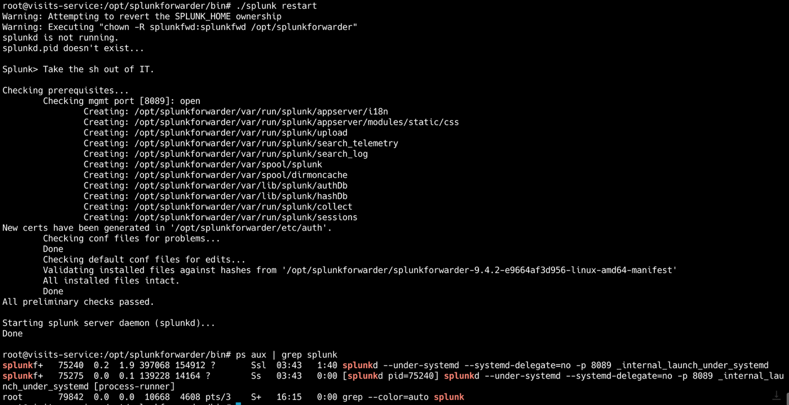
*Image 61: Output of the licenses that needs accepting go and head proceed to the end.*

#### Step 4: Validate in Splunk Instance that data from UF is being received

Go ahead and navigate to the Splunk GUI and login using the provided UN and Password. Search in your designated index (e.g., `index=main sourcetype=my_app_logs`) to see if logs are arriving.

 
*Image 62: Showing the Splunk Cloud GUI successfully receiving data from our UF*

**You also need to add some additional output and verification from the ```splunk Cli```**
-----

### Configure Splunk AppDynamics Agents & Application

1.  Open the AppDynamics UI, go to your **Application**, and open **Tiers & Nodes**.
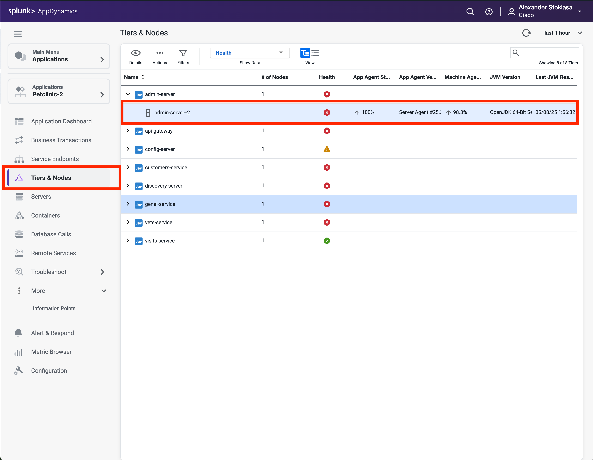
*Image 63: View of the Tier and Nodes screen.*
2.  Double-click on one of the Nodes in the `visits-service` Tier.
3.  On the Node Dashboard, select: **Actions -\> Configure App Server Agent**.
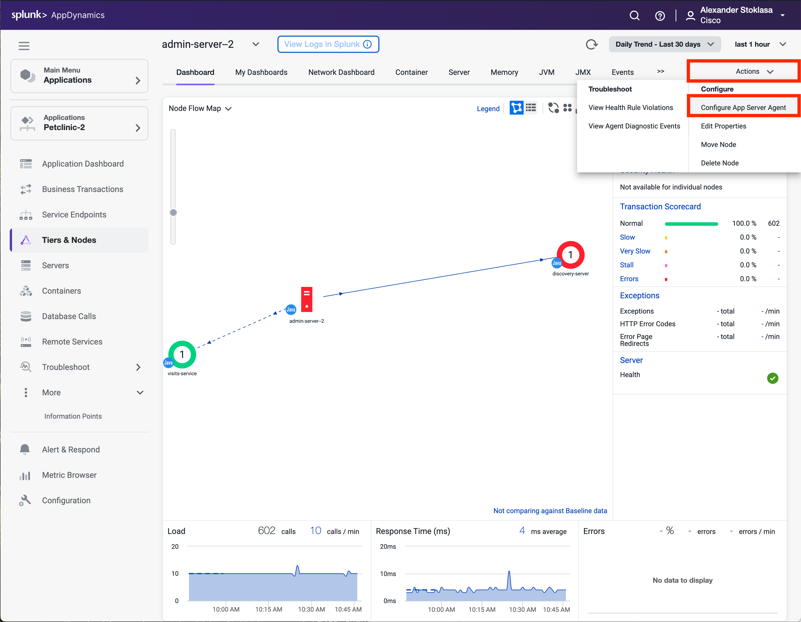
*Image 64: Using the `Actions` buttons to `Configure App Server Agent`*

4.  Select the **Application** level (or Tier/Node level if preferred) and click the **"Plus" Icon** to add a new agent property.
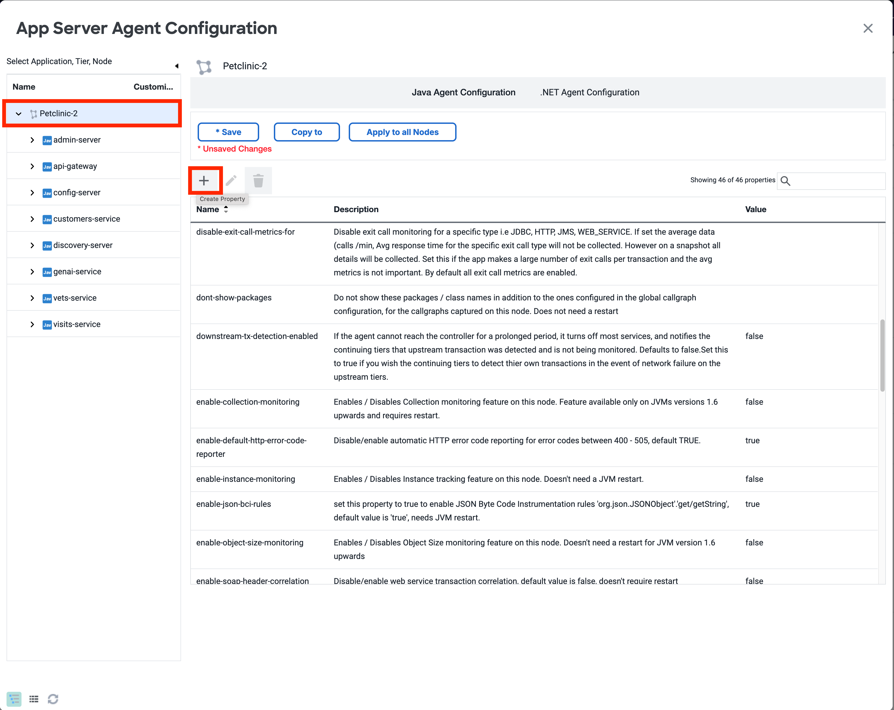
*Image 65: Configuring the Agent Properties.*

    **Note**: This setting can be applied to a single node, a tier, or an entire application. We selected Application so that it will be picked up by all Tiers and Nodes in the lab.
5.  Add the `enable-log-metadata-enrichment` property as **Boolean** with value **true**.
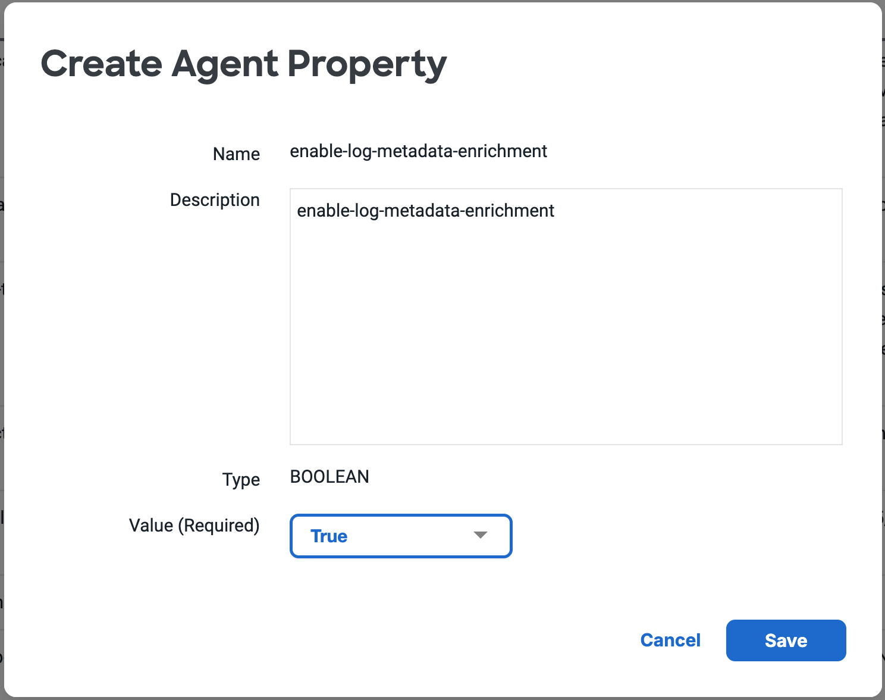
*Image 66: Adding `enable-log-metadata-enrichment` property.*
6.  Click **Save**.

This property will be assigned to all connected agents, as well as to new agents when they connect to the controller, and will start to populate the metadata for:

  * `appd_node_id`
  * `appd_bt_id`
  * `appd_request_guid`

-----

### Update the logging pattern for the `visits-service`

For this, we're going to create a new logback configuration to add the metadata of the agent into the actual log file. More can be found here: [Configure Splunk AppDynamics Agents](https://docs.appdynamics.com/appd/24.x/latest/en/unified-observability-experience-with-splunk/splunk-log-observer-connect-for-cisco-appdynamics/configure-splunk-appdynamics-agents)

1.  On the `visits-service` machine/environment, navigate to the directory where the `visits-service` application is run from (likely `/home/cisco/spring-petclinic-microservices/deployments/hybrid/java` or where `run.sh.loc` is).

2.  Create a new `logback.xml` configuration file in that directory with the following content:

    ```xml
    <configuration>
      <include resource="org/springframework/boot/logging/logback/base.xml"/>
      <appender name="CONSOLE" class="ch.qos.logback.core.ConsoleAppender">
          <encoder>
              <pattern>%d{yyyy-MM-dd HH:mm:ss} %-5p %c{1}:%L - appd_node_id=%X{appd_node_id} appd_bt_id=%X{appd_bt_id} appd_request_guid=%X{appd_request_guid} - %m%n</pattern>
          </encoder>
      </appender>

      <appender name="FILE" class="ch.qos.logback.core.FileAppender">
        <file>app.log</file> <append>false</append>
        <immediateFlush>true</immediateFlush>
        <encoder>
          <pattern>%d{yyyy-MM-dd HH:mm:ss} %-5p %c{1}:%L - appd_node_id=%X{appd_node_id} appd_bt_id=%X{appd_bt_id} appd_request_guid=%X{appd_request_guid} - %m%n</pattern>
        </encoder>
      </appender>

        <root level="INFO">
            <appender-ref ref="CONSOLE"/>
            <appender-ref ref="FILE"/>
        </root>
        <jmxConfigurator/>
    </configuration>
    ```

    Pay attention to the `%X{appd_node_id} %X{appd_bt_id} %X{appd_request_guid}` section; this is where we insert the metadata from the agent into the log pattern.

3.  Restart the application using (ensure you are in the correct directory, e.g., `/home/cisco/spring-petclinic-microservices/deployments/hybrid/java`):

    ```bash
    ./run.sh.loc
    ```

    *(You might need to stop the existing service first if it's running: 
    ```bash
    ps aux | grep java
    kill -9 <PID> # PID of the java applcation. Be sure to kill that and not AppD Agents
    ./run.sh.loc
    ```

-----

### Verification

1.  Create traffic on the Petclinic application by adding visits to Pets (Find Owners, select owner, add visit).
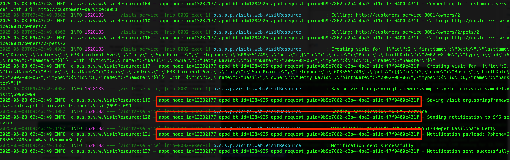
*Image 67: Adding `enable-log-metadata-enrichment` property*

2.  Check the `app.log` file on the `visits-service` node and also verify logs in your Splunk instance. **You might see lines where the metadata is not set. Why could that be?**
-----

## Enable Log Observer Connect in Kubernetes 

Similar to the `visits-service`, we need to update the log configuration for the pods in Kubernetes. To simplify, the logback configuration is mounted as a ConfigMap into the container. A single ConfigMap is shared by all services.

### Install the Splunk Distribution of OpenTelemetry and Enabling Log Connection

Refer to the official documentation for more details:
[Splunk OTel Collector for Kubernetes](https://docs.splunk.com/observability/en/gdi/opentelemetry/collector-kubernetes/collector-kubernetes-intro.html)

1.  Add the Splunk OpenTelemetry Collector Helm chart repository:
    ```bash
    helm repo add splunk-otel-collector-chart https://signalfx.github.io/splunk-otel-collector-chart
    ```
2.  Update your Helm repositories:
    ```bash
    helm repo update
    ```
3.  Create a namespace for Splunk components (if it doesn't exist):
    ```bash
    kubectl create ns splunk
    ```
4.  Install or upgrade the Splunk OpenTelemetry Collector using Helm. You'll need a `values.yaml` file configured for your Splunk instance (realm, access token, etc.).
    ```bash
    helm -n splunk upgrade --install -f values.yaml my-splunk-otel-collector splunk-otel-collector-chart/splunk-otel-collector
    ```
    *(Ensure your `values.yaml` is correctly configured to point to your Splunk Observability Cloud environment and includes settings for log collection.)*
5.  Annotate the `petclinic` namespace to specify the Splunk index for logs collected from this namespace:
    ```bash
    kubectl annotate namespace petclinic splunk.com/index=clus_logs
    ```
    *(Replace `clus_logs` with your desired Splunk index if different.)*

### Update the Log Configuration for all Microservices

1.  Edit the `logback-spring-cm` ConfigMap in the `petclinic` namespace:

    ```bash
    kubectl -n petclinic edit cm logback-spring-cm
    ```
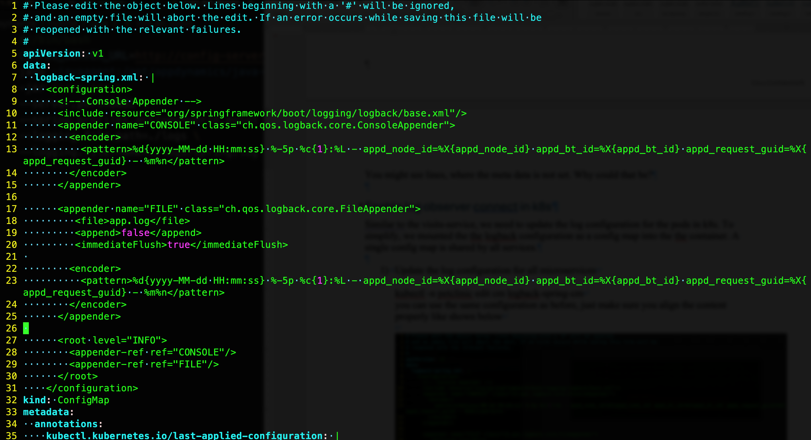
*Image 68: Example of editing the ConfigMap in `vi` with correct indentation for the logback XML*

2.  You can use the same Logback XML configuration as used for the `visits-service` earlier, ensuring it includes the AppDynamics metadata pattern (`appd_node_id=%X{appd_node_id} appd_bt_id=%X{appd_bt_id} appd_request_guid=%X{appd_request_guid}`).
    Make sure you align the content properly within the ConfigMap's data field.
    **Vim Tips:**
      * To display line numbers in vim: `<esc>:set number`
      * To show spaces with a dot and toggle this view: `<esc>:set listchars=space:·` then `<esc>:set list!`

3.  Only newly started pods will use the modified ConfigMap. Restart all deployments in the `petclinic` namespace:

    ```bash
    kubectl -n petclinic rollout restart deployment
    ```

-----

## Adding OpenTelemetry

OpenTelemetry is a collection of tools, APIs, and SDKs used to instrument, generate, collect, and export telemetry data (metrics, logs, and traces) to help you analyze software performance and behavior.
Splunk AppDynamics provides an OpenTelemetry-compatible backend to ingest OpenTelemetry trace data using OpenTelemetry components. The ingested data is processed by the Splunk AppDynamics backend and displayed in the Controller UI. This service is referred to as Splunk AppDynamics for OpenTelemetry.

In this lab, we're going to instrument the pods in the `notification` namespace and the `visits-service` with OpenTelemetry, as these services might be handled by another vendor which does not allow the use of an AppDynamics agent. Still, we would like to get end-to-end visibility in the backend.

### `visits-service` with OpenTelemetry

If you have an application that is monitored with Splunk AppDynamics Java, .NET, or Node.js Agents, you can instrument Splunk AppDynamics agents in your application to report both OpenTelemetry span data and Splunk AppDynamics SaaS data. When instrumented, the agents will generate OpenTelemetry span data from HTTP entry and exit requests.

#### Enable OpenTelemetry in the Java Agent

This can be done by adding some command line parameters when starting the `visits-service`.

1.  The following parameters need to be added to the Java startup command:
    ```bash
    -Dappdynamics.opentelemetry.enabled=true \
    -Dagent.deployment.mode=hybrid \
    -Dotel.traces.exporter=otlp \
    -Dotel.metrics.exporter=otlp \
    -Dotel.resource.attributes="service.name=visits-service,service.namespace=Petclinic-X" \
    -Dotel.exporter.otlp.traces.endpoint=http://collector:4317 \
    -Dotel.exporter.otlp.metrics.endpoint=http://collector:4317
    ```
2.  **Important**: Change `Petclinic-X` in `service.namespace=Petclinic-X` to the value of your group/student ID.
3.  Modify the `run.sh.loc.otel` startup script (or create one based on `run.sh.loc`) for the `visits-service` to include these attributes.
4.  Verify if your `visits-service` can reach the OTel collector's DNS name. If the collector is in a different namespace (e.g., `splunk` or `notification`), the endpoint might need to be fully qualified (e.g., `http://otel-collector.splunk.svc.cluster.local:4317` or `http://otel-collector.notification.svc.cluster.local:4317`). You can test with:
    ```bash
    ping collector # Or the FQDN of your collector
    ```
5.  Restart the `visits-service` using your modified script:
    ```bash
    ./run.sh.loc.otel
    ```
    *(Ensure any previous instance is stopped first.)*

#### Verification

1.  In the AppDynamics Controller, a new application named **Petclinic-X\_otel** (where `X` is your group/student ID) should be created. This might take some time.
2.  Navigate to that application – **Tiers & Nodes** and verify if the `visits-service` shows up as an OTel Tier.
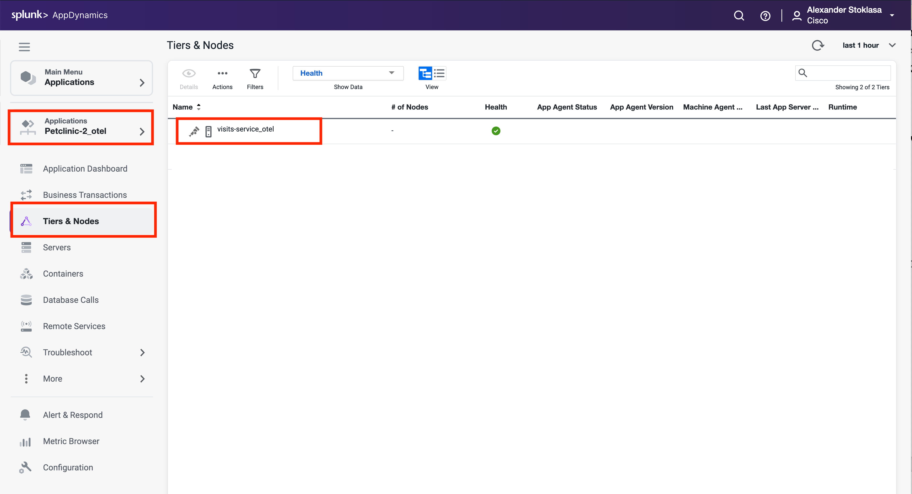
*Image 69: AppDynamics UI showing Petclinic-X\_otel application with visits-service as an OTel Tier*

This configuration will instruct the AppDynamics Agent to also start using OpenTelemetry. It will create OTel traces, which will be sent to downstream systems. We also instruct the agent to send all OTel data to an OpenTelemetry Collector (which might be running in the `notification` service namespace or a dedicated `splunk` namespace) which is already configured to send the data to the backend.

### Notification services with OpenTelemetry

#### Verify and Update the OTel Collector Configuration 

This step assumes an OpenTelemetry Collector is deployed, possibly in the `notification` namespace or a central `splunk` namespace. If you deployed one with Helm earlier, its configuration might be in the `values.yaml` or a separate ConfigMap. For this lab, we assume a ConfigMap `otel-collector-config-map.yaml` might exist or needs adjustment.

1.  Ensure the OTel Collector's configuration correctly sets the `service.namespace` attribute for data originating from the `notification` services. If you are editing a ConfigMap for a collector that specifically serves the `notification` namespace, you might add or modify a processor to set this.
    Example snippet for a processor in an OTel Collector ConfigMap:
    ```yaml
    processors:
      resource:
        attributes:
          - key: service.namespace
            value: Petclinic-X # Change Petclinic-X to your value
            action: insert
    # ... other processor configurations
    ```
2.  If you modified a ConfigMap (e.g., `notification-service/otel-collector-config-map.yaml`), apply it and restart the collector:
    ```bash
    # Example if the ConfigMap is applied from a file:
    # kubectl apply -n notification -f notification-service/otel-collector-config-map.yaml
    # kubectl -n notification rollout restart deployment otel-collector

    # If using the Helm-deployed collector, you might need to update via Helm with a modified values.yaml
    ```

#### Auto-instrument the `notification-service` using OTel Operator

This requires the OpenTelemetry Operator to be installed in your Kubernetes cluster.

1.  Patch the `notification-service` deployment to inject the Java OTel agent automatically:
    ```bash
    kubectl -n notification patch deployment notification-service -p '{"spec":{"template":{"metadata":{"annotations":{"instrumentation.opentelemetry.io/inject-java":"true"}}}}}'
    ```
    *(You might need to specify which OpenTelemetry `Instrumentation` custom resource to use via another annotation if you have multiple, e.g., `instrumentation.opentelemetry.io/java-instrumentation: "my-java-instrumentation"`)*

There is a lot of magic going on behind the scenes, which has been prepared in this lab. If you want to know more, feel free to ask.
In essence, if the OTel Operator is installed in the k8s cluster and an `Instrumentation` custom resource is created (defining how to instrument, e.g., environment variables for exporter endpoint, resource attributes), the Operator sees the annotation attached to deployments. It will then automatically attach the OTel Java agent using the given configuration.

2.  You can look at the `Instrumentation` configuration using:
    ```bash
    kubectl -n notification describe instrumentation # Or use the namespace where your Instrumentation CR is
    ```

#### Verification

1.  As before, check in the **Petclinic-X\_otel** application in AppDynamics for a new tier, possibly named `notification-service` or similar, based on how `service.name` is set for its OTel data.
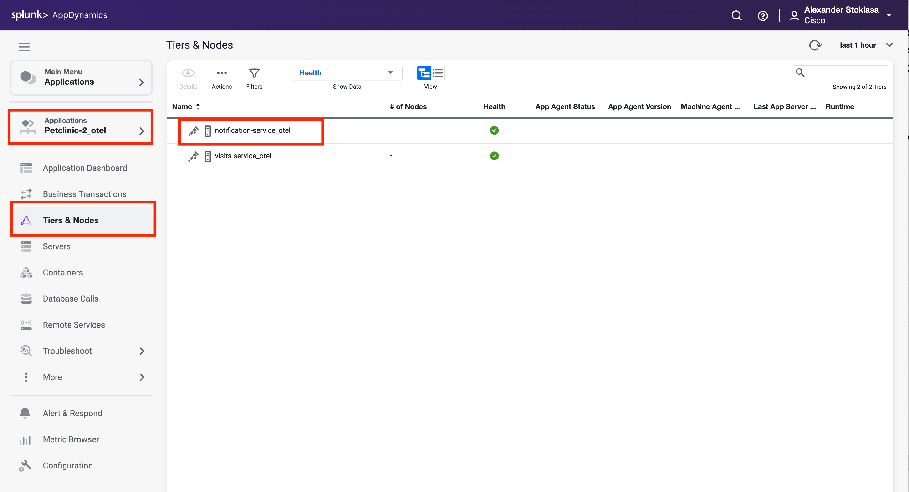
*Image 70: Successful Auto-Instrumentation of the notification service.*

-----

<!-- 
============================================================================
                          BACKEND DETECTION RULES
============================================================================
-->

## Backend Detection Rules
*Estimated Time: 20-30 minutes*

### Learning Objectives

By completing this section, you will be able to:

* Understand what backend systems are and why they're critical for monitoring
* Configure custom backend detection rules for improved visibility
* Apply backend naming strategies that provide better context
* Validate that backend detection changes are working correctly
* Apply best practices for backend system monitoring

### Overview and Importance

In Splunk AppDynamics, **backends** refer to any out-of-process components involved in Business Transaction processing, including:

| Backend Type | Examples | Importance |
|--------------|----------|------------|
| **Databases** | MySQL, PostgreSQL, MongoDB, Oracle | Store application data, often the source of performance bottlenecks |
| **Remote Services** | REST APIs, SOAP services, gRPC | Enable service-to-service communication in distributed systems |
| **Message Queues** | RabbitMQ, Kafka, ActiveMQ | Support asynchronous processing and event-driven architectures |
| **Cache Systems** | Redis, Memcached, Hazelcast | Improve performance through data caching |
| **External Calls** | Third-party APIs, Cloud services | Integrate with external systems and services |

Properly configured backend detection is crucial for:

* **Complete Visibility**: Seeing all service dependencies in your application flow map
* **Performance Analysis**: Identifying which external systems are causing bottlenecks
* **Problem Isolation**: Determining if issues originate in your code or in external services
* **Capacity Planning**: Understanding the load your application places on various backend systems
* **Root Cause Analysis**: Quickly identifying the source of performance problems

> **Why This Matters**: In modern distributed applications, up to 80% of performance issues originate in backend systems rather than the application code itself. Properly identifying and monitoring these systems is essential for effective troubleshooting.

Splunk AppDynamics automatically discovers backends through **exit point instrumentation** in the application code. An **exit point** is the precise location where an outbound call is made from an instrumented node. While the default detection is often sufficient, customizing backend detection can provide more meaningful insights for your specific environment.

### Types of Backend Detection Configurations
*Estimated Time: 5 minutes*

AppDynamics offers two main approaches to backend detection:

1. **Automatic Discovery**: The default mechanism that identifies backends based on predefined rules
   * Enabled by default for common backend types (HTTP, databases, caches, etc.)
   * Uses default naming conventions (e.g., hostname and port for HTTP services)
   * Requires minimal configuration but offers less customization

2. **Custom Detection Rules**: User-defined rules for specific backend detection requirements
   * Can detect backends not covered by automatic discovery
   * Supports complex naming strategies and pattern matching
   * Allows for more precise control over what's monitored
   * Similar to business transaction detection rules in structure

In this exercise, we'll focus on customizing the automatic discovery settings to improve the naming of HTTP backends, which will give you a foundation for more advanced customizations later.

### Exercise: Customizing HTTP Backend Detection
*Estimated Time: 10 minutes*

In this exercise, you'll modify how HTTP backends are named in your application, consolidating services with different ports under a single logical backend.

#### Step 1: Access Backend Detection Configuration

1. In the AppDynamics Controller UI, navigate to:
   * Click on **Configuration** in the left navigation menu
   * Select **Instrumentation**
   * Click on **Backend Detection**

2. In the Configuration screen:
   * Select your **Application** (e.g., Petclinic-X) from the dropdown
   * Ensure you're working with your assigned application

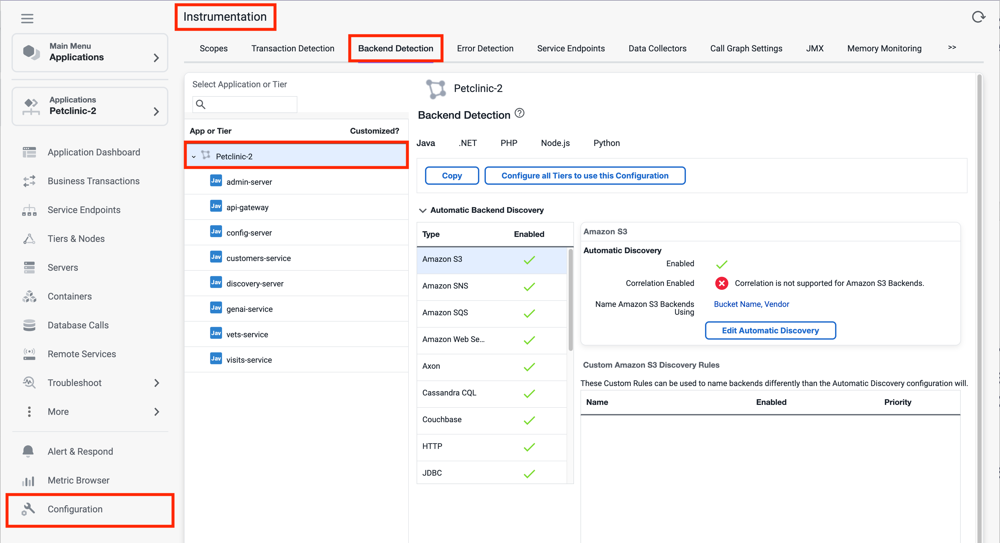
*Image 71: Backend Detection configuration screen, application selection*

**Expected Outcome**: The backend detection configuration page should load, showing the current settings for your application.

**Validation**: You should see various backend types listed (HTTP, Database, etc.) with their current configuration status.

#### Step 2: Configure Tier-Specific Settings

AppDynamics allows you to configure backend detection at three levels: application, tier, and node. In this exercise, we'll apply configuration at the tier level.

1. In the tier selection dropdown:
   * Select the **"visits-service"** Tier
   * This will focus our changes on just one component of the application

2. Enable tier-specific configuration:
   * Check the box for **"Use Custom Configuration for this Tier"**
   * This activates the ability to override application-level settings
   * Settings applied at the tier level have precedence over application-level settings

**Expected Outcome**: The interface should update to show tier-specific configuration options, with checkboxes and settings becoming available.

**Validation**: Verify that the tier name is displayed correctly and that configuration options are now active.

#### Step 3: Customize HTTP Backend Naming

Now we'll modify how HTTP backends are named to use only the hostname instead of hostname and port.

1. Locate the HTTP backend section:
   * In the **Automatic Discovery** section, find the row for **HTTP** backend type
   * This section controls how HTTP calls to external services are detected and named

2. Edit detection settings:
   * Click **"Edit Automatic Discovery"** button next to HTTP
   * A dialog will appear with configuration options

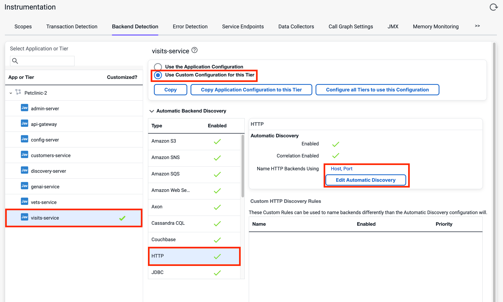
*Image 72: HTTP Automatic Discovery settings*

3. Modify naming configuration:
   * In the **Naming Configuration** dropdown:
     * Current setting: "Host,Port" (the default)
     * Change to: "Host only"
   * This change will consolidate all backends with the same hostname but different ports
   * For example, `api.example.com:8080` and `api.example.com:8081` will both appear as `api.example.com`

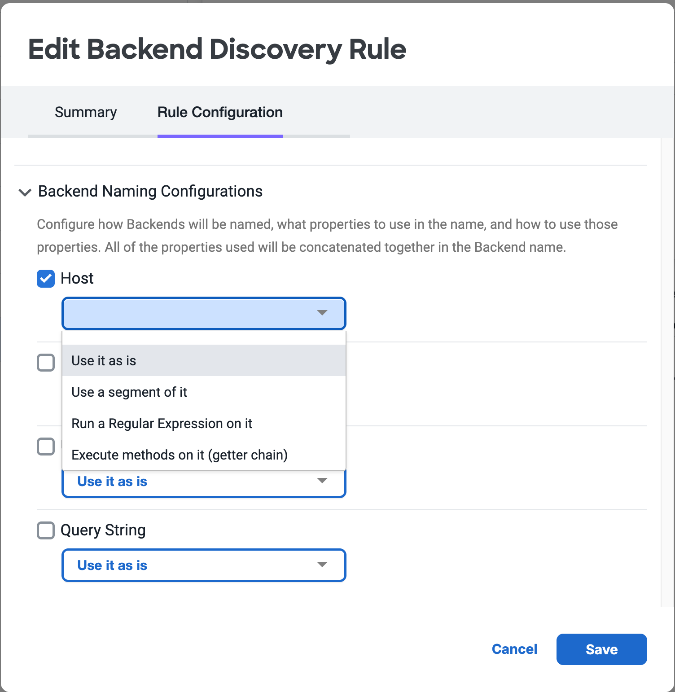
*Image 73: HTTP Backend Naming Configuration modified to "Host only"*

**Example Before Change**:
```
discovery-server:8761 (10 calls/min, 235ms avg. response time)
discovery-server:8762 (5 calls/min, 198ms avg. response time)
```

**Example After Change**:
```
discovery-server (15 calls/min, 223ms avg. response time)
```

> **Note**: The statistics from both backends will be combined, giving you a consolidated view of all traffic to that host.

**Expected Outcome**: The naming configuration dropdown should now show "Host only" instead of "Host,Port".

## Renaming Business Transactions

While the auto-discovered Business Transaction names might be good for a more technical audience, sometimes it would be useful to have a more "speaking" name. While you could change your BT detection rules, there is a more elegant solution available by renaming the BT while keeping its original name. This way you can satisfy technical and non-technical users.

1.  Select the Business Transaction you want to rename from the Business Transactions list.
2.  Right-click on the Business Transaction.

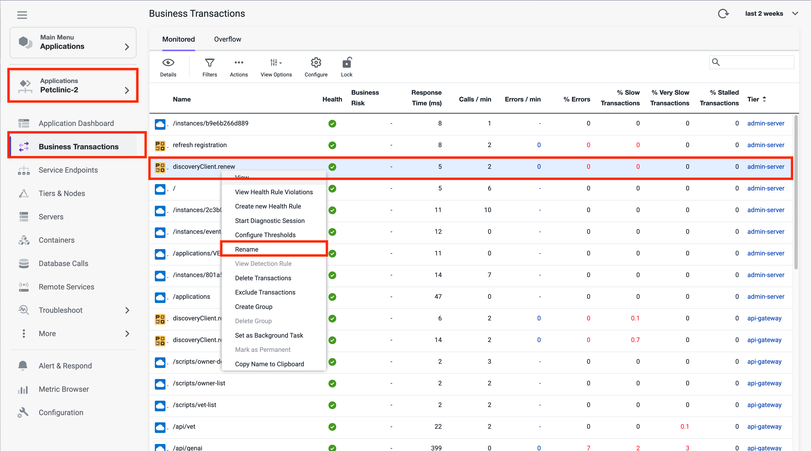
*Image 75: Business Transaction list with a BT right-clicked.*
3.  Select **"Rename"** from the context menu.
4.  Enter a more friendly or descriptive name in the dialog box.
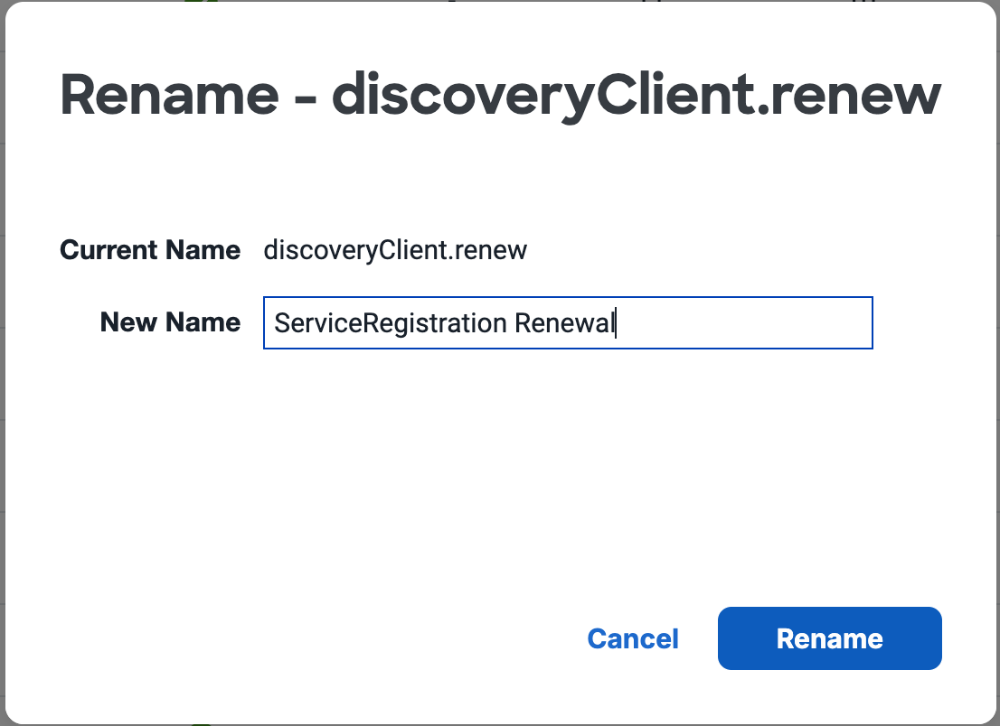
*Image 76: Rename Business Transaction dialog box.*

5.  Click **Rename**.
    This will have an immediate effect and will update the Business Transaction view.
6.  To see both the new display name and the original auto-discovered name, select **"View Options"** (often a gear icon or dropdown in the BT list view).
7.  Select **"Original Name"** (or a similar option to show original/internal names).
    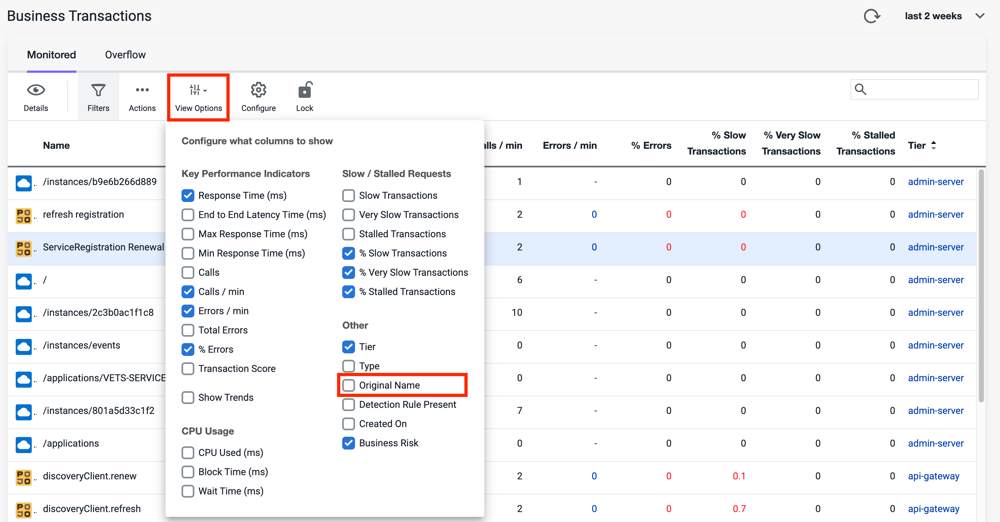
    *Image 77: View Options menu with "Original Name" selected*

    This now will show both names in the BT UI, providing clarity for different user perspectives.
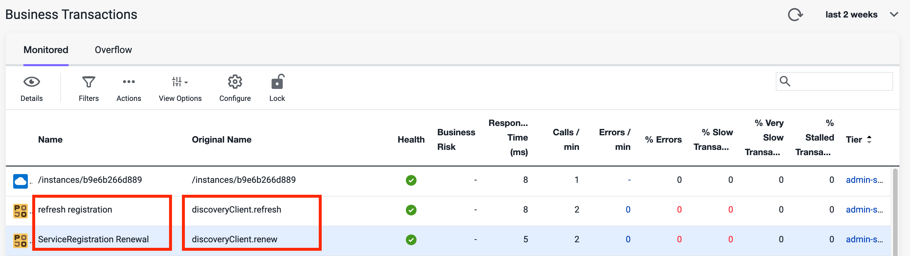
*Image 78: Business Transaction list showing both display name and original name*

<!-- 
============================================================================
                          LAB GUIDE SUMMARY
============================================================================
-->

## Lab Guide Summary

### What You've Accomplished

Congratulations! Throughout this lab, you've successfully implemented a comprehensive monitoring solution for a hybrid microservices application using Splunk AppDynamics. Here's a summary of your key achievements:

1. **Environment Setup and Application Deployment**:
   * Deployed the Spring PetClinic microservices application across multiple environments
   * Set up containerized services in Kubernetes and standalone services on VMs
   * Created a realistic hybrid architecture reflecting modern deployment patterns

2. **AppDynamics Agent Deployment**:
   * Installed and configured the AppDynamics Cluster Agent for Kubernetes monitoring
   * Deployed the Java Agent to monitor the visits-service
   * Set up the Database Agent to monitor the MySQL database
   * Implemented the Machine Agent for infrastructure visibility
   * Configured Browser Real User Monitoring (BRUM) for frontend performance tracking

3. **Advanced Monitoring Configuration**:
   * Customized Business Transaction detection and naming
   * Configured Backend Detection rules for improved visibility
   * Created Service Endpoints for API-centric monitoring
   * Implemented OpenTelemetry integration for comprehensive observability
   * Set up Log Observer Connect for integrated log analysis

4. **Alert and Operational Setup**:
   * Created Health Rules to define normal application behavior
   * Configured alerts and policies for proactive monitoring
   * Implemented best practices for monitoring and alert management

### Key Takeaways

Through this lab, you've gained practical experience with:

* **End-to-End Observability**: Implementing comprehensive monitoring across a distributed system
* **Hybrid Monitoring**: Configuring monitoring for both containerized and non-containerized services
* **Agent Deployment Options**: Using different deployment methods including GUI, SmartAgent, and automated approaches
* **Advanced Configurations**: Customizing AppDynamics to provide meaningful insights for your specific application
* **OpenTelemetry Integration**: Combining traditional agent-based monitoring with open standards-based telemetry
* **Unified Observability**: Connecting logs, metrics, and traces for holistic application visibility

### Real-World Application

The skills you've developed in this lab directly apply to real-world scenarios:

* **Microservices Monitoring**: The techniques you've learned are essential for monitoring distributed architectures
* **Kubernetes Observability**: You now understand how to gain visibility into containerized environments
* **Hybrid Cloud Monitoring**: The lab's hybrid setup mirrors the reality of many enterprise deployments
* **Alert Management**: You've implemented a practical approach to alert configuration that can scale to enterprise environments

### Next Steps

To build on what you've learned:

1. **Explore Advanced Analytics**:
   * Investigate Business iQ capabilities for business-oriented monitoring
   * Implement dashboards and reports for key stakeholders

2. **Expand Monitoring Coverage**:
   * Apply these techniques to other applications in your environment
   * Explore additional agent types for other technologies (NodeJS, .NET, etc.)

3. **Integrate with CI/CD**:
   * Automate agent deployment as part of application deployments
   * Implement pre-production monitoring for quality assurance

4. **Enhance Alert Strategy**:
   * Develop a comprehensive alerting framework
   * Integrate with existing incident management systems

### Resources for Further Learning

* [Splunk AppDynamics Documentation](https://docs.appdynamics.com/)
* [OpenTelemetry Documentation](https://opentelemetry.io/docs/)
* [Kubernetes Monitoring Resources](https://kubernetes.io/docs/tasks/debug/debug-cluster/resource-usage-monitoring/)
* [Spring Boot Monitoring Best Practices](https://docs.spring.io/spring-boot/docs/current/reference/html/actuator.html)

Thank you for participating in this lab! We hope you found it valuable and that you'll apply these monitoring techniques to improve observability in your own environments.

-----
